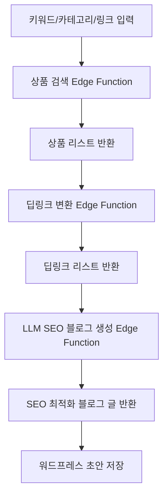

# 🛠️ Coupang Partners Auto-Blog SaaS

## 프로젝트 개요

쿠팡 파트너스 상품 검색, 딥링크 변환, SEO 최적화 블로그 자동생성, 워드프레스 초안 저장까지 원클릭으로 처리하는 SaaS 서비스입니다.

- **Next.js 15 + Zustand + shadcn/ui + Tailwind** 기반 프론트엔드
- **Supabase Edge Functions** 기반 백엔드
- **쿠팡 오픈API** 상품검색/딥링크/카테고리 연동
- **OpenAI** 기반 LLM SEO 블로그 자동작성
- **검색 이력, 상태 영속화, 반응형 UI/UX**

## 🏗️ 프로젝트 아키텍처

### 폴더 구조

```
frontend/src/
├── app/                    # Next.js App Router
│   ├── api/               # API 라우트
│   ├── auth/              # 인증 페이지
│   ├── login/             # 로그인 페이지
│   ├── product/           # 상품 페이지
│   ├── layout.tsx         # 루트 레이아웃
│   ├── page.tsx           # 홈페이지
│   └── globals.css        # 전역 스타일
│
├── features/              # 도메인별 기능
│   ├── auth/              # 인증 기능
│   │   ├── components/    # 인증 관련 컴포넌트
│   │   ├── hooks/         # 인증 관련 훅
│   │   ├── types/         # 인증 타입 정의
│   │   └── utils/         # 인증 유틸리티
│   │
│   ├── product/           # 상품 기능
│   │   ├── components/    # 상품 관련 컴포넌트
│   │   ├── hooks/         # 상품 관련 훅
│   │   ├── types/         # 상품 타입 정의
│   │   └── utils/         # 상품 유틸리티
│   │
│   └── search/            # 검색 기능
│       ├── components/    # 검색 관련 컴포넌트
│       ├── hooks/         # 검색 관련 훅
│       ├── types/         # 검색 타입 정의
│       └── utils/         # 검색 유틸리티
│
├── shared/                # 공통 모듈
│   ├── ui/                # 재사용 가능한 UI 컴포넌트
│   ├── lib/               # 공통 라이브러리
│   ├── hooks/             # 공통 훅
│   ├── types/             # 공통 타입 정의
│   └── styles/            # 공통 스타일
│
├── infrastructure/        # 외부 서비스 연동
│   ├── api/               # API 클라이언트
│   ├── auth/              # 인증 서비스
│   └── utils/             # 외부 서비스 유틸리티
│
├── store/                 # 상태 관리
└── types/                 # 전역 타입 정의
```

### 아키텍처 패턴

**Next.js App Router + Feature-Based Architecture**를 채택했습니다:

- **Feature-First**: 도메인별 기능을 `features/` 폴더로 분리
- **Shared Modules**: 재사용 가능한 모듈을 `shared/` 폴더로 통합
- **Infrastructure Layer**: 외부 서비스 연동을 `infrastructure/` 폴더로 분리
- **Clean Separation**: 관심사 분리로 유지보수성과 확장성 향상

### 주요 원칙

1. **도메인 분리**: 각 기능은 독립적인 도메인으로 관리
2. **재사용성**: 공통 모듈은 `shared/` 폴더에 배치
3. **확장성**: 새로운 기능 추가 시 `features/` 폴더에 추가
4. **타입 안전성**: TypeScript를 활용한 엄격한 타입 정의
5. **테스트 가능성**: 각 레이어별 독립적인 테스트 작성 가능

---

## 전체 플로우



---

## 주요 기능

- **키워드/카테고리/링크 기반 상품 검색**
  - 쿠팡 오픈API 상품검색, 카테고리별 베스트 상품, 직접 링크 입력 지원
- **딥링크 일괄 변환**
- **SEO 최적화 블로그 자동작성 (OpenAI)**
- **검색 이력/상태 영속화 (Zustand + localStorage)**
- **카테고리/가격/로켓배송/무료배송/필터링**
  - 카테고리별 셀렉트, 이미지 사이즈/비율, limit, 가격대(프리셋/직접입력), 로켓/무료배송 뱃지, 실시간 필터링
- **반응형 UI/UX**
  - 그리드/리스트 뷰, 검색 이력 모달, 카드 디자인, 전체선택, 수정 등
- **검색 이력 삭제/상세 모달**

---

## API/Edge Function 설계

1. **상품 검색**
   - `POST /api/products/search`
   - 입력: `{ keyword: string }`
   - 출력: `[ { title, image, price, url, ... } ]`
2. **카테고리 베스트 상품 검색**
   - `GET /api/products/bestcategories/{categoryId}?limit=50&imageSize=512x512`
   - 입력: `categoryId`, `limit`, `imageSize`
   - 출력: `[ { categoryName, isRocket, isFreeShipping, productId, productImage, productName, productPrice, productUrl } ]`
3. **딥링크 변환**
   - `POST /api/products/deeplink`
   - 입력: `{ urls: string[] }`
   - 출력: `[ { originalUrl, deepLink } ]`
4. **블로그 글 생성**
   - `POST /api/blog/generate`
   - 입력: `{ keyword: string, products: Product[], deepLinks: DeepLink[] }`
   - 출력: `{ html: string, markdown: string }`

---

## 쿠팡 베스트 카테고리 상품 API 응답 필드

| 필드명           | 타입      | 설명                |
|------------------|-----------|---------------------|
| categoryName     | string    | 카테고리명          |
| isRocket         | boolean   | 로켓배송 여부       |
| isFreeShipping   | boolean   | 무료배송 여부       |
| productId        | number    | 상품 ID             |
| productImage     | string    | 상품 이미지 URL     |
| productName      | string    | 상품명              |
| productPrice     | number    | 상품 가격           |
| productUrl       | string    | 트래킹 URL          |

---

## 프론트엔드 주요 UX/기능

- **검색 방식**: 키워드, 카테고리, 링크 직접 입력 탭 지원
- **카테고리 검색**: 카테고리 셀렉트, 이미지 가로/세로, 비율, limit(최대 100), 가격 필터(프리셋/직접입력)
- **상품 카드**: 가격, 로켓배송/무료배송 뱃지, 카테고리명, 링크, 전체선택, 수정, 반응형 그리드/리스트
- **검색 이력**: 상세 모달, 삭제 버튼, PC/모바일 대응
- **상태 영속화**: 뷰 타입, 검색 결과, 선택 결과, 이력 등 localStorage 저장

---

## 개발 단계

- [x] 상품 검색 Edge Function 구현
- [x] 딥링크 변환 Edge Function 구현
- [x] SEO 블로그 자동생성 Edge Function 구현
- [x] 카테고리/가격/로켓/무료배송/필터/검색이력 등 프론트 UX 개선
- [ ] 워드프레스 초안 저장 기능
- [ ] E2E/유닛 테스트, 배포 자동화

---

## 🚀 개발 가이드

### 새로운 기능 추가하기

1. **새로운 도메인 기능 추가**
   ```bash
   # features 폴더에 새로운 도메인 생성
   mkdir -p src/features/new-feature/{components,hooks,types,utils}
   ```

2. **공통 컴포넌트 추가**
   ```bash
   # shared/ui 폴더에 재사용 가능한 컴포넌트 추가
   touch src/shared/ui/NewComponent.tsx
   ```

3. **외부 서비스 연동**
   ```bash
   # infrastructure 폴더에 API 클라이언트 추가
   touch src/infrastructure/api/new-service.ts
   ```

### 코딩 컨벤션

- **파일명**: PascalCase (컴포넌트), camelCase (함수, 변수)
- **폴더명**: kebab-case
- **타입 정의**: 각 도메인별로 `types/` 폴더에 정의
- **테스트**: 각 기능과 동일한 구조로 `__tests__/` 폴더에 배치

### 마이그레이션 가이드

기존 파일들을 새로운 구조로 이동하는 방법:

```bash
# 1. lib 폴더 파일들을 infrastructure로 이동
mv src/lib/coupang.ts src/infrastructure/api/
mv src/lib/supabase.ts src/infrastructure/api/
mv src/lib/utils.ts src/shared/lib/

# 2. components 폴더를 features로 분리
mv src/components/auth/* src/features/auth/components/
mv src/components/product/* src/features/product/components/
mv src/components/ui/* src/shared/ui/

# 3. hooks 폴더를 features로 분리
mv src/hooks/useProductFilter.ts src/features/product/hooks/
```

---

## 참고/확장 예정

- 쿠팡 오픈API 공식문서: https://developers.coupang.com/
- 카테고리별 상품 랭킹, 다양한 필터, 멀티채널 발행, A/B 프롬프트, CLI 등 확장 가능 