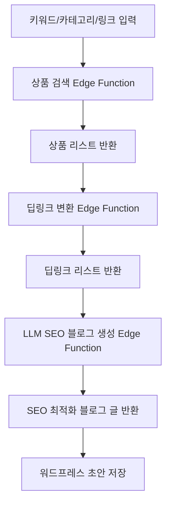

# 🛠️ Coupang Partners Auto-Blog SaaS

## 프로젝트 개요

쿠팡 파트너스 상품 검색, 딥링크 변환, SEO 최적화 블로그 자동생성, 워드프레스 초안 저장까지 원클릭으로 처리하는 SaaS 서비스입니다.

- **Next.js 15 + Zustand + shadcn/ui + Tailwind** 기반 프론트엔드
- **Supabase Edge Functions** 기반 백엔드
- **쿠팡 오픈API** 상품검색/딥링크/카테고리 연동
- **OpenAI** 기반 LLM SEO 블로그 자동작성
- **검색 이력, 상태 영속화, 반응형 UI/UX**

---

## 전체 플로우

---

## 주요 기능

- **키워드/카테고리/링크 기반 상품 검색**
  - 쿠팡 오픈API 상품검색, 카테고리별 베스트 상품, 직접 링크 입력 지원
- **딥링크 일괄 변환**
- **SEO 최적화 블로그 자동작성 (OpenAI)**
- **검색 이력/상태 영속화 (Zustand + localStorage)**
- **카테고리/가격/로켓배송/무료배송/필터링**
  - 카테고리별 셀렉트, 이미지 사이즈/비율, limit, 가격대(프리셋/직접입력), 로켓/무료배송 뱃지, 실시간 필터링
- **반응형 UI/UX**
  - 그리드/리스트 뷰, 검색 이력 모달, 카드 디자인, 전체선택, 수정 등
- **검색 이력 삭제/상세 모달**

---

## API/Edge Function 설계

1. **상품 검색**
   - `POST /api/products/search`
   - 입력: `{ keyword: string }`
   - 출력: `[ { title, image, price, url, ... } ]`
2. **카테고리 베스트 상품 검색**
   - `GET /api/products/bestcategories/{categoryId}?limit=50&imageSize=512x512`
   - 입력: `categoryId`, `limit`, `imageSize`
   - 출력: `[ { categoryName, isRocket, isFreeShipping, productId, productImage, productName, productPrice, productUrl } ]`
3. **딥링크 변환**
   - `POST /api/products/deeplink`
   - 입력: `{ urls: string[] }`
   - 출력: `[ { originalUrl, deepLink } ]`
4. **블로그 글 생성**
   - `POST /api/blog/generate`
   - 입력: `{ keyword: string, products: Product[], deepLinks: DeepLink[] }`
   - 출력: `{ html: string, markdown: string }`

---

## 쿠팡 베스트 카테고리 상품 API 응답 필드

| 필드명           | 타입      | 설명                |
|------------------|-----------|---------------------|
| categoryName     | string    | 카테고리명          |
| isRocket         | boolean   | 로켓배송 여부       |
| isFreeShipping   | boolean   | 무료배송 여부       |
| productId        | number    | 상품 ID             |
| productImage     | string    | 상품 이미지 URL     |
| productName      | string    | 상품명              |
| productPrice     | number    | 상품 가격           |
| productUrl       | string    | 트래킹 URL          |

---

## 프론트엔드 주요 UX/기능

- **검색 방식**: 키워드, 카테고리, 링크 직접 입력 탭 지원
- **카테고리 검색**: 카테고리 셀렉트, 이미지 가로/세로, 비율, limit(최대 100), 가격 필터(프리셋/직접입력)
- **상품 카드**: 가격, 로켓배송/무료배송 뱃지, 카테고리명, 링크, 전체선택, 수정, 반응형 그리드/리스트
- **검색 이력**: 상세 모달, 삭제 버튼, PC/모바일 대응
- **상태 영속화**: 뷰 타입, 검색 결과, 선택 결과, 이력 등 localStorage 저장

---

## 개발 단계

- [x] 상품 검색 Edge Function 구현
- [x] 딥링크 변환 Edge Function 구현
- [x] SEO 블로그 자동생성 Edge Function 구현
- [x] 카테고리/가격/로켓/무료배송/필터/검색이력 등 프론트 UX 개선
- [ ] 워드프레스 초안 저장 기능
- [ ] E2E/유닛 테스트, 배포 자동화

---

## 참고/확장 예정

- 쿠팡 오픈API 공식문서: https://developers.coupang.com/
- 카테고리별 상품 랭킹, 다양한 필터, 멀티채널 발행, A/B 프롬프트, CLI 등 확장 가능 