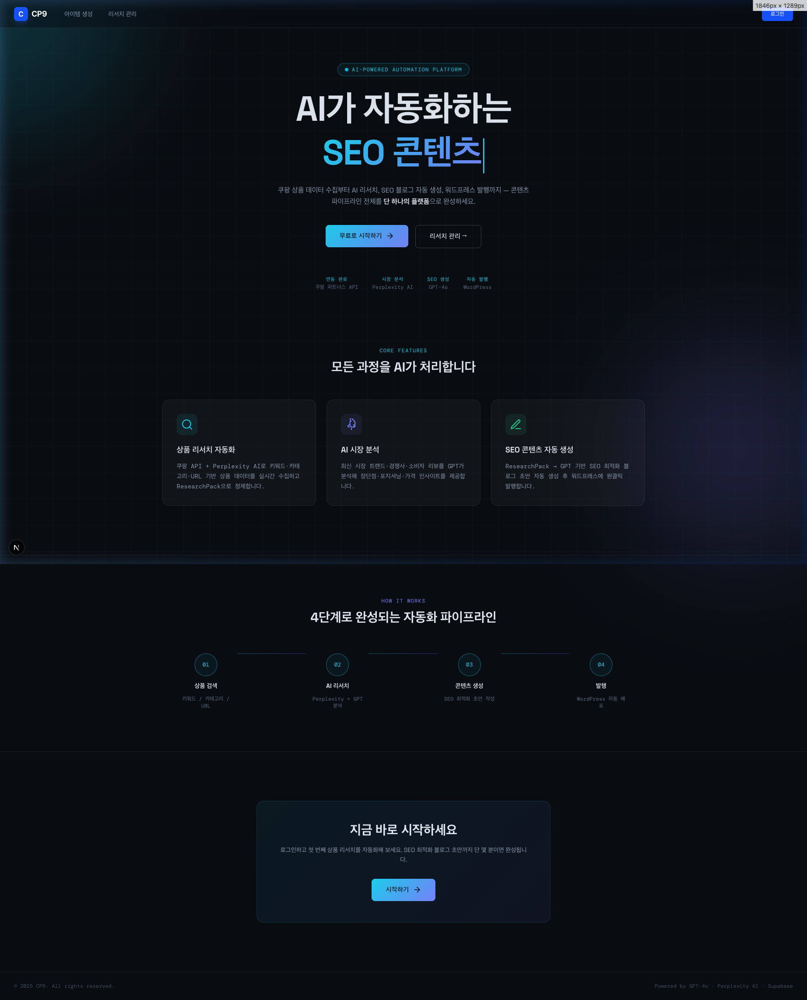
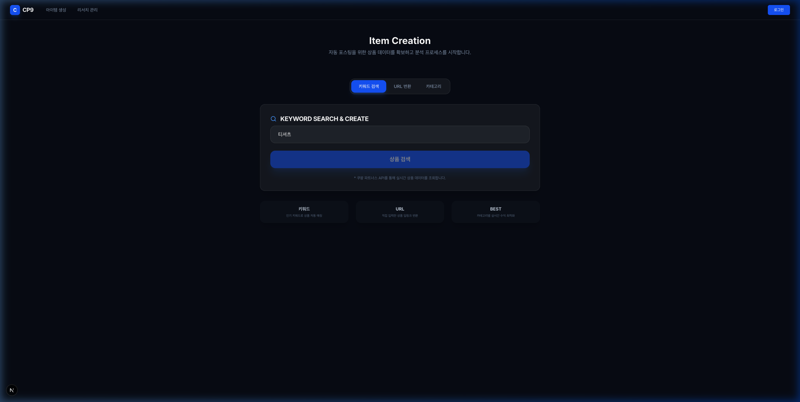
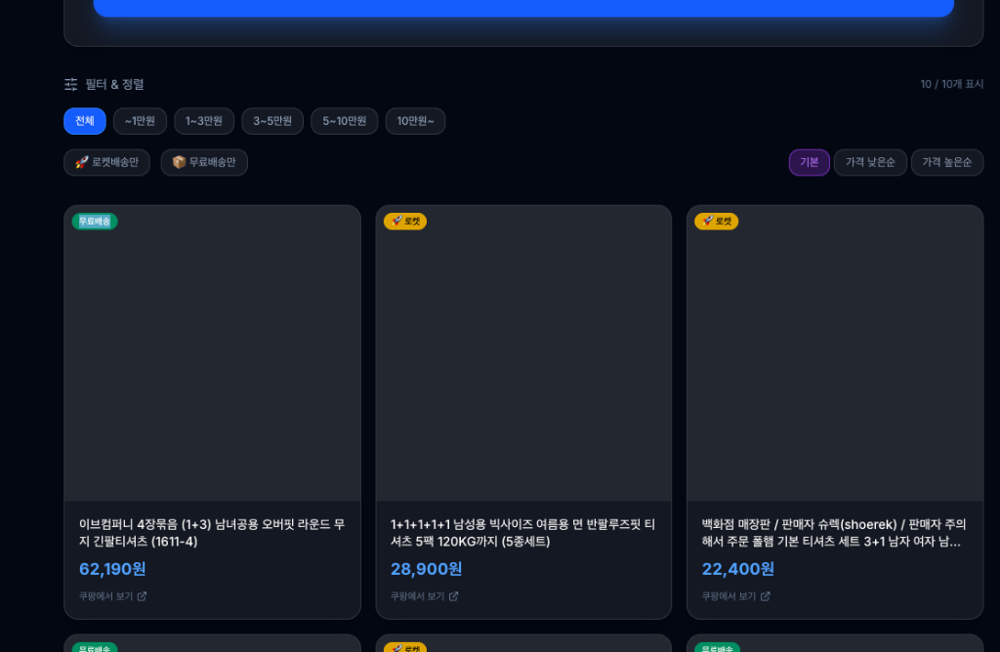

# CP9 - AI-Powered Product Research & Content Generation Platform

## 🚀 프로젝트 개요

CP9은 AI 기술을 활용하여 상품 리서치부터 SEO 콘텐츠 생성까지 자동화하는 플랫폼입니다.

## 📁 프로젝트 구조

```
cp9/
├── frontend/                 # Next.js 15 프론트엔드
│   ├── src/
│   │   ├── app/             # App Router 페이지
│   │   │   ├── product/           # 상품 검색 페이지
│   │   │   ├── research/          # 🆕 리서치 관리 페이지
│   │   │   ├── research-results/  # 리서치 결과 페이지
│   │   │   ├── auth/              # 인증 페이지
│   │   │   ├── test/              # 테스트 페이지들
│   │   │       ├── item-research/ # 아이템 리서치 및 SEO 파이프라인
│   │   │       ├── research/      # 리서치 데이터 조회
│   │   │       └── drafts/        # 초안 데이터 조회
│   │   │
│   │   ├── features/         # 기능별 모듈
│   │   │   ├── auth/          # 인증 기능
│   │   │   ├── product/       # 상품 검색/관리
│   │   │   ├── research/      # 🆕 리서치 관리 기능
│   │   │   ├── workflow/      # AI 워크플로우 기능
│   │   │   ├── search/        # 검색 기능
│   │   │   └── enrichment/    # 데이터 보강 기능
│   │   │
│   │   ├── shared/           # 공통 모듈
│   │   │   ├── components/    # 공통 UI 컴포넌트
│   │   │   ├── hooks/         # 공통 훅
│   │   │   ├── lib/           # 유틸리티 라이브러리
│   │   │   ├── types/         # 공통 타입 정의
│   │   │   └── ui/            # 기본 UI 컴포넌트
│   │   │
│   │   └── infrastructure/    # 외부 서비스 연동
│   │       ├── api/           # API 클라이언트
│   │       │   ├── supabase.ts    # Supabase 클라이언트
│   │       │   └── perplexity.ts  # Perplexity API 클라이언트
│   │       ├── scraping/          # 웹 스크래핑
│   │       │   ├── coupang-scraper.ts
│   │       │   └── scrapfly-scraper.ts
│   │       ├── cache/             # 캐시 시스템
│   │       │   └── redis.ts
│   │       ├── queue/             # 큐 시스템
│   │       │   └── worker.ts
│   │       └── utils/             # 외부 서비스 유틸리티
│   │           └── coupang-hmac.ts # 쿠팡 HMAC 서명 생성
│   │
├── store/                 # Zustand 상태 관리
│   └── searchStore.ts     # 검색 상태 관리
│
└── components/            # Legacy 컴포넌트 (features/ 로 이관 예정)
    ├── auth/              # AuthForm 테스트 등
    ├── common/            # navbar.tsx
    └── ui/                # 기존 UI 컴포넌트 (shared/ui/ 와 중복)

supabase/                  # Supabase 환경설정 및 DB 스키마
├── functions/             # (삭제 예정) 기존 Edge Functions
└── migrations/            # 데이터베이스 마이그레이션
    └── 20250110_create_drafts_table.sql # 🆕 drafts 테이블

package.json               # 글로벌 의존성 관리
```

## 🎯 주요 기능

### 1. 상품 검색 및 분석
- **키워드 검색**: 상품명 기반 쿠팡 상품 검색
- **카테고리 검색**: 베스트 카테고리 기반 상품 탐색
- **URL 검색**: 상품 링크 직접 분석
- **딥링크 변환**: 쿠팡 파트너스 딥링크 자동 생성

### 2. AI 리서치 시스템
- **Perplexity AI 연동**: 최신 시장 정보 기반 상품 분석
- **자동 리서치**: 상품명 → ResearchPack 자동 생성
- **데이터 저장**: Supabase 데이터베이스에 리서치 결과 저장

### 3. SEO 콘텐츠 생성
- **AI 글 작성**: GPT 기반 SEO 최적화 콘텐츠 생성
- **초안 관리**: 생성된 콘텐츠 초안 저장 및 편집
- **워드프레스 연동**: 승인된 콘텐츠 자동 발행

### 4. 워크플로우 자동화
- **LangGraph 기반**: 복잡한 워크플로우 자동화
- **큐 시스템**: 대량 처리 작업 관리
- **실시간 상태 추적**: 작업 진행 상황 모니터링

## 🛠 기술 스택

### Frontend
- **Next.js 15** (App Router + React 19)
- **TypeScript** (엄격한 타입 안전성)
- **Tailwind CSS** (유틸리티 우선 CSS)
- **Zustand** (상태 관리)
- **Radix UI** (접근성 컴포넌트)

### Backend
- **Supabase** (PostgreSQL + Auth + Edge Functions)
- **Deno** (Edge Functions 런타임)
- **Redis** (캐싱 및 큐)
- **LangGraph** (AI 워크플로우)

### AI & External APIs
- **OpenAI GPT** (콘텐츠 생성)
- **Perplexity AI** (실시간 리서치)
- **Coupang Partners** (상품 데이터)
- **WordPress REST API** (콘텐츠 발행)

## 📊 데이터베이스 스키마

### 핵심 테이블
- **research**: 리서치 데이터 (ResearchPack 형태)
- **drafts**: SEO 글 초안
- **projects**: 프로젝트 관리
- **items**: 상품 아이템

## 📸 핵심 로직 실행 가이드 (SEO 파이프라인)

본 플랫폼의 주 무기인 **쿠팡 파트너스 연동 및 AI SEO 자동화**의 실행 순서는 다음과 같습니다.

### 1단계: 쿠팡 파트너스 상품 검색 및 선택
사용자가 원하는 쿠팡 상품(PL 혹은 일반 상품)을 검색한 뒤 목록에서 상품을 여러 개 선택합니다. 클릭할 때마다 하단 Sticky Bar에 "선택된 아이템 통계"가 노출됩니다.





### 2단계: SEO 페르소나 및 톤앤매너 설정
선택한 상품을 가지고 `[SEO 글 작성]` 버튼을 누르면 설정 모달이 뜹니다.
여기서 **단일 딥다이브 / 다중 비교 분석 / 다수 큐레이션** 등 목적에 맞는 '페르소나'와 **전문적 / 친근한 / 유머러스한** 등 대상 고객층에 맞는 '톤앤매너'를 설정할 수 있습니다.



### 3단계: AI 파이프라인 구동 및 저장
설정을 마치면 백엔드에서 `Perplexity(Sonar-Pro)`를 통해 최신 시장 반응을 조사하고, `GPT-4o`가 이를 취합해 SEO 최적화된 마크다운 본문을 작성하며, 마지막으로 `DALL-E 3`를 호출해 대표 썸네일을 생성합니다. 
생성된 데이터는 즉시 Supabase의 `ResearchItem` 테이블에 백업됩니다.

---

## 🚀 시작하기
### 1. 환경 설정
```bash
# 프론트엔드
cd frontend
npm install
npm run dev

# 백엔드
cd backend
npm install
npm run dev
```

### 2. 환경 변수 설정
```bash
# .env.local 혹은 .env 파일 구성
NEXT_PUBLIC_SUPABASE_URL=your_supabase_url
NEXT_PUBLIC_SUPABASE_ANON_KEY=your_anon_key
SUPABASE_SERVICE_ROLE_KEY=your_service_role_key

# AI Provider Keys
OPENAI_API_KEY=your_openai_key
PERPLEXITY_API_KEY=your_perplexity_key

# Coupang API Keys
COUPANG_ACCESS_KEY=your_coupang_access_key
COUPANG_SECRET_KEY=your_coupang_secret_key
```

### 3. Supabase 설정
```bash
cd supabase
supabase start
# supabase functions serve (Node API 마이그레이션으로 생략 가능)
```

## 📈 개발 진행도

### ✅ 완료된 기능
- [x] **🔍 상품 검색 시스템** - 쿠팡 API 연동, 키워드/카테고리/URL 검색
- [x] **🔗 딥링크 변환** - 쿠팡 파트너스 딥링크 자동 생성
- [x] **🔐 인증 시스템** - Supabase Auth + Google OAuth
- [x] **📊 상품 데이터 관리** - 검색 결과 저장, 선택/필터링
- [x] **🔍 리서치 데이터 시스템** - 백엔드 아이템 리서치 및 작성 레이어 구현
- [x] **📝 작성 레이어 (5장)** - ResearchPack → GPT SEO 콘텐츠 생성
- [x] **🎯 리서치 관리 UI** - 프론트엔드 리서치 데이터 확인/편집/SEO 글 생성 인터페이스

### 🚧 현재 상태 및 진행도

#### **백엔드 시스템** (5/7 단계 완료)
- ✅ **1-2단계**: 상품 검색 → 아이템 리서치 완료
- ✅ **3단계**: ResearchPack 저장 (`research` 테이블)
- ✅ **4단계**: GPT 기반 SEO 콘텐츠 생성 (`write` Edge Function)
- ✅ **5단계**: 초안 저장 (`drafts` 테이블)
- 🔄 **6단계**: 검수 레이어 (approve/re-research/rewrite) - **진행 예정**
- 🔄 **7단계**: 발행 레이어 (WordPress 자동 발행) - **진행 예정**

#### **프론트엔드 시스템** (4/5 단계 완료)
- ✅ **상품 검색 UI**: 키워드/카테고리/URL 기반 검색
- ✅ **리서치 관리 UI**: `/research` 페이지에서 데이터 확인/편집
- ✅ **SEO 글 생성**: 개별/일괄 SEO 글 생성 요청
- ✅ **상태 추적**: 초안 생성 여부 실시간 확인
- 🔄 **초안 검수 UI**: 생성된 초안 확인/수정/발행 - **진행 예정**

### 🔄 진행 중인 작업
- [X] **환경 변수 설정** - Supabase Dashboard에서 OPENAI_API_KEY 설정
- [X] **리서치 관리 시스템 구현** - 프론트엔드 리서치 데이터 CRUD 완료
- [ ] **6장: 검수 레이어 구현** - approve/re-research/rewrite 분기
- [ ] **7장: 발행 레이어 구현** - WordPress 자동 발행 시스템
- [ ] **초안 검수 UI 구현** - 생성된 초안 확인/수정/발행 페이지

### 📋 향후 계획
- [ ] **검수 워크플로우 구현** - 사용자 승인/거부/재작업 플로우
- [ ] **WordPress 발행 자동화** - 승인된 초안 자동 발행
- [ ] **대시보드 구현** - 전체 프로젝트/아이템 현황 대시보드
- [ ] **E2E 테스트 구현** - 전체 플로우 E2E 테스트
- [ ] **성능 최적화** - 대량 처리 최적화, 캐싱 전략
- [ ] **배포 자동화** - CI/CD 파이프라인 구축

## 🧪 테스트

### 프론트엔드 테스트
```bash
cd frontend
npm run test        # Vitest
npm run test:ui     # 테스트 UI
npm run test:e2e    # Playwright E2E
```

### 백엔드 테스트
```bash
cd backend
npm run test        # Edge Functions 테스트
```

## 📚 API 문서

### Edge Functions (사용 해제)
- 기존 DB 프로시저/클라우드 함수 대신 현재 Node API Route(`api/item-research`)로 기능 통폐합이 완료되었습니다.

### 주요 API 엔드포인트
- `POST /api/item-research` - 통합 파이프라인 (상품 리서치, SEO 글 작성, 이미지 자동 생성)
- `GET  /api/research` - 생성된 리서치(뷰티/가전/등) 데이터 조회
- `GET  /api/drafts` - 최종 생성된 글 초안 데이터 가져오기

## 🤝 기여하기

1. Fork the repository
2. Create your feature branch (`git checkout -b feature/amazing-feature`)
3. Commit your changes (`git commit -m 'Add some amazing feature'`)
4. Push to the branch (`git push origin feature/amazing-feature`)
5. Open a Pull Request

## 📄 라이선스

이 프로젝트는 MIT 라이선스 하에 배포됩니다.

## 📞 문의

프로젝트에 대한 문의사항이 있으시면 이슈를 생성해 주세요. 