# 🛠️ Coupang Partners Auto-Blog SaaS

## 프로젝트 개요

쿠팡 파트너스 상품 검색, 딥링크 변환, SEO 최적화 블로그 자동생성, 워드프레스 초안 저장까지 원클릭으로 처리하는 SaaS 서비스입니다.

- **Next.js 15 + Zustand + shadcn/ui + Tailwind** 기반 프론트엔드
- **Supabase Edge Functions** 기반 백엔드
- **쿠팡 오픈API** 상품검색/딥링크/카테고리 연동
- **Perplexity API** 기반 LLM SEO 블로그 자동작성
- **LangGraph JS** 기반 자동화 워크플로우
- **검색 이력, 상태 영속화, 반응형 UI/UX**
- **TypeScript 기반 타입 안전성 및 API 일관성**

## 🏗️ 프로젝트 아키텍처

### 폴더 구조

```
frontend/src/
├── app/                    # Next.js App Router
│   ├── api/               # API 라우트 (일관된 응답 형식)
│   │   ├── products/      # 상품 관련 API
│   │   │   ├── search/    # 상품 검색 API
│   │   │   ├── deeplink/  # 딥링크 변환 API
│   │   │   └── bestcategories/ # 베스트 카테고리 API
│   │   └── README.md      # API 가이드
│   ├── auth/              # 인증 페이지
│   ├── login/             # 로그인 페이지
│   ├── product/           # 상품 페이지
│   ├── simple-test/       # LangGraph 노드 테스트 페이지
│   ├── layout.tsx         # 루트 레이아웃
│   ├── page.tsx           # 홈페이지
│   └── globals.css        # 전역 스타일
│
├── features/              # 도메인별 기능
│   ├── auth/              # 인증 기능
│   │   ├── components/    # 인증 관련 컴포넌트
│   │   ├── contexts/      # 인증 컨텍스트
│   │   ├── hooks/         # 인증 관련 훅
│   │   ├── types/         # 인증 타입 정의
│   │   └── utils/         # 인증 유틸리티
│   │
│   ├── product/           # 상품 기능
│   │   ├── components/    # 상품 관련 컴포넌트
│   │   ├── hooks/         # 상품 관련 훅
│   │   ├── types/         # 상품 타입 정의
│   │   └── utils/         # 상품 유틸리티
│   │
│   ├── search/            # 검색 기능
│   │   ├── components/    # 검색 관련 컴포넌트
│   │   ├── hooks/         # 검색 관련 훅
│   │   ├── types/         # 검색 타입 정의
│   │   └── utils/         # 검색 유틸리티
│   │
│   └── langgraph/         # LangGraph 자동화 시스템
│       ├── types/         # LangGraph 타입 정의
│       ├── nodes/         # LangGraph 노드들
│       │   ├── extract-ids.ts
│       │   ├── static-crawler.ts
│       │   ├── dynamic-crawler.ts
│       │   ├── fallback-llm.ts
│       │   ├── seo-agent.ts
│       │   └── wordpress-publisher.ts
│       ├── graphs/        # LangGraph 그래프 정의
│       │   └── main-graph.ts
│       ├── memory/        # 메모리 관리 전략
│       └── utils/         # LangGraph 유틸리티
│
├── shared/                # 공통 모듈
│   ├── ui/                # 재사용 가능한 UI 컴포넌트
│   ├── lib/               # 공통 라이브러리
│   │   └── api-utils.ts   # API 응답 정규화 유틸리티
│   ├── hooks/             # 공통 훅
│   ├── types/             # 공통 타입 정의
│   │   └── api.ts         # API 타입 정의
│   └── styles/            # 공통 스타일
│
├── infrastructure/        # 외부 서비스 연동
│   ├── api/               # API 클라이언트
│   │   ├── coupang.ts     # 쿠팡 상품 검색 API
│   │   ├── coupang-best-category.ts # 쿠팡 베스트 카테고리 API
│   │   ├── wordpress.ts   # WordPress REST API 클라이언트
│   │   ├── langgraph.ts   # LangGraph API 클라이언트
│   │   └── supabase.ts    # Supabase 클라이언트
│   ├── queue/             # 큐 시스템
│   │   └── worker.ts      # 큐 워커 클라이언트
│   ├── utils/             # 외부 서비스 유틸리티
│   │   └── coupang-hmac.ts # 쿠팡 HMAC 서명 생성
│   ├── auth/              # 인증 서비스
│   └── README.md          # Infrastructure 가이드
│
├── store/                 # 상태 관리
    └── searchStore.ts     # 검색 상태 관리 (Zustand)

backend/supabase/functions/
├── cache-gateway/         # 캐시 게이트웨이 Edge Function
├── queue-worker/          # 큐 워커 Edge Function
├── langgraph-api/         # LangGraph API Edge Function
└── README.md              # Edge Functions 가이드
```

### 아키텍처 패턴

**Next.js App Router + Feature-Based Architecture + LangGraph Workflow**를 채택했습니다:

- **Feature-First**: 도메인별 기능을 `features/` 폴더로 분리
- **LangGraph Integration**: 자동화 워크플로우를 `features/langgraph/` 폴더로 관리
- **Shared Modules**: 재사용 가능한 모듈을 `shared/` 폴더로 통합
- **Infrastructure Layer**: 외부 서비스 연동을 `infrastructure/` 폴더로 분리
- **API Consistency**: 모든 API가 일관된 응답 형식 사용
- **Type Safety**: TypeScript 기반 엄격한 타입 정의

### 주요 원칙

1. **도메인 분리**: 각 기능은 독립적인 도메인으로 관리
2. **워크플로우 자동화**: LangGraph를 통한 복잡한 비즈니스 로직 자동화
3. **재사용성**: 공통 모듈은 `shared/` 폴더에 배치
4. **확장성**: 새로운 기능 추가 시 `features/` 폴더에 추가
5. **타입 안전성**: TypeScript를 활용한 엄격한 타입 정의 (`any` 타입 제거)
6. **API 일관성**: 모든 API가 동일한 응답 형식 사용
7. **테스트 가능성**: 각 레이어별 독립적인 테스트 작성 가능

---

## 🔌 API 엔드포인트

### 일관된 응답 형식

모든 API는 `CoupangProductResponse` 인터페이스를 따르는 일관된 응답 형식을 사용합니다:

```typescript
interface CoupangProductResponse {
  productName: string;
  productImage: string;
  productPrice: number;                 
  productUrl: string;
  productId: number;
  isRocket: boolean;
  isFreeShipping: boolean;
  categoryName: string;
}
```

### API 목록

1. **상품 검색 API**
   - `POST /api/products/search`
   - 입력: `{ keyword: string, limit?: number }`
   - 출력: `CoupangProductResponse[]`

2. **베스트 카테고리 상품 API**
   - `POST /api/products/bestcategories`
   - 입력: `{ categoryId: string, limit?: number, imageSize?: string }`
   - 출력: `CoupangProductResponse[]`

3. **딥링크 변환 API**
   - `POST /api/products/deeplink`
   - 입력: `{ urls: string[] }`
   - 출력: `DeepLinkResponse[]`
   ```json
   [
     {
       "originalUrl": "https://www.coupang.com/vp/products/4589310169?itemId=5639449741",
       "shortenUrl": "https://link.coupang.com/a/cFWt0G",
       "landingUrl": "https://link.coupang.com/re/AFFSDP?lptag=AF7133746&pageKey=4589310169&itemId=5639449741&traceid=..."
     }
   ]
   ```

4. **LangGraph API** (Edge Function)
   - `POST /api/langgraph/execute` - 그래프 실행
   - `POST /api/langgraph/resume` - 체크포인트에서 재개
   - `GET /api/langgraph/status/:threadId` - 실행 상태 조회

5. **Cache Gateway API** (Edge Function)
   - `POST /api/cache-gateway` - 캐시 확인 및 큐 작업 추가

6. **Queue Worker API** (Edge Function)
   - `POST /api/queue-worker` - 큐 작업 처리

---

## 전체 플로우

### 1. 사용자 입력 단계

```mermaid
graph TD
A[사용자 입력] --> A1[키워드 검색]
A --> A2[카테고리 선택]
A --> A3[직접 링크 입력]
A1 --> B[상품 검색 API]
A2 --> B
A3 --> B
```


### 2. 상품 정보 수집 단계

```mermaid
graph TD
B[상품 검색 API] --> C[일관된 응답 형식으로 변환]
C --> D[딥링크 변환 API]
D --> E[딥링크 리스트 반환]
E --> F[사용자 선택]
F --> G[SEO 글 작성 버튼 클릭]
```


### 3. LangGraph 자동화 워크플로우

```mermaid
graph TD
G[SEO 글 작성 버튼] --> H[LangGraph API 호출]
H --> I[extractIds 노드]
I --> J{상품 ID 추출 성공?}
J -->|Yes| K[staticCrawler 노드]
J -->|No| END1[프로세스 종료]
K --> L{정적 크롤링 성공?}
L -->|Yes| M[seoAgent 노드]
L -->|No| N[dynamicCrawler 노드]
N --> O{동적 크롤링 성공?}
O -->|Yes| M
O -->|No| P[fallbackLLM 노드]
P --> Q{LLM 보강 성공?}
Q -->|Yes| M
Q -->|No| END2[프로세스 종료]
M --> R{SEO 콘텐츠 생성 성공?}
R -->|Yes| S[wordpressPublisher 노드]
R -->|No| END3[프로세스 종료]
S --> T{포스트 발행 성공?}
T -->|Yes| U[WordPress 초안 저장]
T -->|No| END4[프로세스 종료]
```


### 4. 상세 워크플로우 단계별 설명

#### 4-1. **사용자 입력 → 상품 검색**
- **입력 방식**: 키워드 검색, 카테고리 선택, 직접 링크 입력
- **처리**: 쿠팡 오픈API를 통한 상품 검색
- **출력**: `CoupangProductResponse[]` 형식의 상품 목록

#### 4-2. **딥링크 변환**
- **입력**: 상품 URL 목록
- **처리**: 쿠팡 딥링크 API 호출
- **출력**: `DeepLinkResponse[]` 형식의 딥링크 목록

#### 4-3. **LangGraph 자동화 시스템 시작**
- **트리거**: 사용자가 "SEO 글 작성" 버튼 클릭
- **초기화**: 선택된 상품 정보로 LangGraph 상태 초기화

#### 4-4. **extractIds 노드**
- **목적**: 쿠팡 URL에서 상품 ID 추출
- **방법**: 정규표현식 패턴 매칭
- **성공 조건**: 상품 ID 추출 완료
- **실패 시**: 프로세스 종료

#### 4-5. **staticCrawler 노드**
- **목적**: 정적 HTML에서 상품 정보 크롤링
- **도구**: Cheerio (HTML 파싱)
- **수집 정보**: 상품명, 가격, 이미지, 카테고리, 평점, 리뷰 수
- **성공 시**: seoAgent 노드로 진행
- **실패 시**: dynamicCrawler 노드로 폴백

#### 4-6. **dynamicCrawler 노드** (구현 예정)
- **목적**: JavaScript 렌더링 후 상품 정보 크롤링
- **도구**: Playwright (동적 웹 크롤링)
- **사용 시기**: staticCrawler 실패 시
- **성공 시**: seoAgent 노드로 진행
- **실패 시**: fallbackLLM 노드로 폴백

#### 4-7. **fallbackLLM 노드**
- **목적**: 크롤링 실패 시 AI로 상품 정보 보강
- **도구**: Perplexity API
- **생성 정보**: 상품 특징, 장점, 타겟 고객층, 경쟁사 정보
- **성공 시**: seoAgent 노드로 진행
- **실패 시**: 프로세스 종료

#### 4-8. **seoAgent 노드**
- **목적**: SEO 최적화된 블로그 콘텐츠 생성
- **방법**: ReAct 패턴 (Think → Act → Observe → Reflect)
- **생성 콘텐츠**: 제목, 본문, 키워드, 요약
- **성공 시**: wordpressPublisher 노드로 진행
- **실패 시**: 프로세스 종료

#### 4-9. **wordpressPublisher 노드**
- **목적**: WordPress에 포스트 발행
- **도구**: WordPress REST API
- **중복 방지**: product_id 메타데이터, 제목 유사도 체크
- **발행 방식**: 초안으로 생성 (사용자 확인 후 발행)
- **성공 시**: WordPress 초안 저장 완료
- **실패 시**: 프로세스 종료

### 5. 데이터 흐름

```mermaid
graph LR
A[상품 정보] --> B[크롤링/보강]
B --> C[SEO 콘텐츠]
C --> D[WordPress 포스트]
D --> E[사용자 확인]
E --> F[최종 발행]
```



### 6. 오류 처리 및 폴백 전략

```mermaid
graph TD
A[정적 크롤링] --> B{성공?}
B -->|Yes| C[SEO 콘텐츠 생성]
B -->|No| D[동적 크롤링]
D --> E{성공?}
E -->|Yes| C
E -->|No| F[LLM 보강]
F --> G{성공?}
G -->|Yes| C
G -->|No| H[프로세스 종료]
C --> I{성공?}
I -->|Yes| J[WordPress 발행]
I -->|No| H
J --> K{성공?}
K -->|Yes| L[완료]
K -->|No| H
```



---

## 주요 기능

- **키워드/카테고리/링크 기반 상품 검색**
  - 쿠팡 오픈API 상품검색, 카테고리별 베스트 상품, 직접 링크 입력 지원
- **딥링크 일괄 변환**
- **LangGraph 기반 자동화 시스템**
  - 딥링크 → 상품 정보 크롤링 → SEO 콘텐츠 생성 → WordPress 발행
- **SEO 최적화 블로그 자동작성 (Perplexity API)**
- **검색 이력/상태 영속화 (Zustand + localStorage)**
- **카테고리/가격/로켓배송/무료배송/필터링**
  - 카테고리별 셀렉트, 이미지 사이즈/비율, limit, 가격대(프리셋/직접입력), 로켓/무료배송 뱃지, 실시간 필터링
- **반응형 UI/UX**
  - 그리드/리스트 뷰, 검색 이력 모달, 카드 디자인, 전체선택, 수정 등
- **검색 이력 삭제/상세 모달**
- **타입 안전성**: `any` 타입 제거, 명시적 타입 정의
- **API 일관성**: 모든 API가 동일한 응답 형식 사용

---

## 🛠️ 기술 스택

### 프론트엔드
- **Next.js 15**: App Router 기반 SSR/SSG
- **TypeScript**: 엄격한 타입 정의 및 타입 안전성
- **Zustand**: 상태 관리 (검색 결과, 이력, 설정)
- **Tailwind CSS**: 유틸리티 기반 스타일링
- **shadcn/ui**: 재사용 가능한 UI 컴포넌트
- **React Hook Form**: 폼 상태 관리

### 백엔드
- **Supabase**: 데이터베이스, 인증, 실시간 기능
- **Supabase Edge Functions**: 서버리스 함수
- **쿠팡 오픈API**: 상품 검색, 딥링크 변환
- **Perplexity API**: LLM 기반 블로그 자동 생성
- **WordPress REST API**: 블로그 포스트 발행
- **Redis**: 캐싱, 체크포인트, 큐 시스템

### 자동화 시스템
- **LangGraph JS**: 워크플로우 자동화 프레임워크
- **Cheerio**: 정적 HTML 파싱
- **Playwright**: 동적 웹 크롤링 (구현 예정)

### 개발 도구
- **ESLint**: 코드 품질 관리
- **Prettier**: 코드 포맷팅
- **Vitest**: 단위 테스트
- **Playwright**: E2E 테스트q

---

## 개발 단계

### ✅ 완료된 기능
- [x] 상품 검색 API 구현
- [x] 딥링크 변환 API 구현
- [x] SEO 블로그 자동생성 API 구현
- [x] 카테고리/가격/로켓/무료배송/필터/검색이력 등 프론트 UX 개선
- [x] **API 일관성 개선** - 모든 API가 동일한 응답 형식 사용
- [x] **타입 안전성 강화** - `any` 타입 제거, 명시적 타입 정의
- [x] **Infrastructure 정리** - 외부 API 클라이언트 구조화
- [x] **딥링크 API 수정** - 쿠팡 API 실제 응답 구조에 맞게 수정
- [x] **LangGraph 통합 준비** - 프로젝트 상태 분석 및 아키텍처 설계
- [x] **LangGraph 노드 구현** - extractIds, staticCrawler, dynamicCrawler, fallbackLLM, seoAgent, wordpressPublisher 노드 구현
- [x] **LangGraph 노드 테스트** - 브라우저 기반 노드 테스트 완료
- [x] **SEO 글 작성 UI** - 선택된 상품에 대한 액션 선택 모달 구현
- [x] **LangGraph Edge Function** - Supabase Edge Function으로 LangGraph API 배포
- [x] **SEO 글 생성 기능** - GPT 기반 SEO 최적화 글 생성 및 새 탭 표시

### 🔄 현재 구현 상태

#### 1단계: 사용자 입력 → 상품 검색 ✅
- 키워드 검색, 카테고리 선택, 직접 링크 입력
- 쿠팡 오픈API 연동 완료
- 딥링크 변환 완료
- Next.js Image 컴포넌트 최적화 완료

#### 2단계: SEO 글 작성 버튼 → LangGraph API ✅
- 선택된 상품에 대한 액션 선택 모달
- "링크 복사" 또는 "SEO 글 작성" 옵션
- LangGraph API 호출 구현
- 아키텍처 리팩토링 완료 (컴포넌트, 훅, 유틸리티 분리)

#### 3단계: LangGraph 워크플로우 (실제 API 연동) ✅
- **extractIds 노드**: ✅ 구현 완료
- **staticCrawler 노드**: ✅ 실제 쿠팡 API 연동 완료
- **dynamicCrawler 노드**: 🔄 구현 예정 (Playwright)
- **fallbackLLM 노드**: ✅ 실제 Perplexity API 연동 완료
- **seoAgent 노드**: ✅ GPT 기반 SEO 글 생성 완료
- **wordpressPublisher 노드**: ✅ 실제 WordPress API 연동 완료

#### 4단계: SEO 글 생성 시스템 ✅
- **API 구조 수정**: `action` 필드 추가, 변수 구조분해할당 수정
- **Edge Function 배포**: Supabase Edge Function 재배포 완료
- **오류 로깅 개선**: 상세한 오류 정보 제공
- **환경 변수 설정**: Supabase Dashboard에서 환경 변수 설정 필요

### 🚧 진행 중인 작업
- [X] **환경 변수 설정** - Supabase Dashboard에서 OPENAI_API_KEY 설정
- [ ] **dynamicCrawler 노드 구현** - Playwright를 사용한 동적 크롤링
- [ ] **실제 크롤링 테스트** - Cheerio와 Playwright 통합 테스트
- [ ] **WordPress 발행 테스트** - 실제 WordPress REST API 연동 테스트
- [ ] **사용자 확인 단계** - 발행 전 최종 확인 UI 구현

### 📋 향후 계획
- [ ] **메모리 관리 구현** - RedisSaver, MemorySaver, Cross-thread KV 구현
- [ ] **프론트엔드 통합** - 기존 CP9 UI에 LangGraph 기반 자동화 플로우 통합
- [ ] **E2E 테스트 및 최적화** - 전체 플로우 E2E 테스트, 성능 최적화, 오류 처리 개선
- [ ] **워드프레스 초안 저장 기능** - 사용자 확인 후 발행 기능
- [ ] **E2E/유닛 테스트, 배포 자동화** - CI/CD 파이프라인 구축
- [ ] **GitHub 푸시 보호 해결** - API 키 보안 문제 해결 및 푸시 완료

---

## 🚀 개발 가이드

### 새로운 기능 추가하기

1. **새로운 도메인 기능 추가**
   ```bash
   # features 폴더에 새로운 도메인 생성
   mkdir -p src/features/new-feature/{components,hooks,types,utils}
   ```

2. **공통 컴포넌트 추가**
   ```bash
   # shared/ui 폴더에 재사용 가능한 컴포넌트 추가
   touch src/shared/ui/NewComponent.tsx
   ```

3. **외부 서비스 연동**
   ```bash
   # infrastructure 폴더에 API 클라이언트 추가
   touch src/infrastructure/api/new-service.ts
   ```

4. **새로운 API 추가**
   ```bash
   # API 라우트 추가
   mkdir -p src/app/api/new-feature
   touch src/app/api/new-feature/route.ts
   
   # 타입 정의 추가
   # src/shared/types/api.ts에 타입 추가
   ```

5. **LangGraph 노드 추가**
   ```bash
   # LangGraph 노드 추가
   touch src/features/langgraph/nodes/new-node.ts
   
   # 그래프에 노드 통합
   # src/features/langgraph/graphs/main-graph.ts 수정
   ```

### 코딩 컨벤션

- **파일명**: PascalCase (컴포넌트), camelCase (함수, 변수)
- **폴더명**: kebab-case
- **타입 정의**: 각 도메인별로 `types/` 폴더에 정의
- **API 응답**: `CoupangProductResponse` 인터페이스 준수
- **타입 안전성**: `any` 타입 사용 금지, 명시적 타입 정의
- **테스트**: 각 기능과 동일한 구조로 `__tests__/` 폴더에 배치
- **LangGraph 노드**: `'use server'` 지시어 사용, 서버 사이드에서만 실행

### API 개발 가이드

새로운 API를 추가할 때 다음 사항을 확인하세요:

1. **타입 정의**: `src/shared/types/api.ts`에 요청/응답 타입 정의
2. **응답 형식**: `CoupangProductResponse` 인터페이스 준수 (딥링크 API 제외)
3. **오류 처리**: 일관된 오류 처리 패턴 적용
4. **환경 변수**: 필수 환경 변수 검증
5. **문서화**: JSDoc 주석 작성

#### 딥링크 API 특별 처리

딥링크 API는 상품 정보를 포함하지 않고 딥링크 URL만 반환하므로 별도 처리:

```typescript
// 딥링크 API 응답 처리
const deeplinkResults: DeepLinkResponse[] = deeplinkList.map(normalizeDeepLinkResponse);
```

#### 일반 상품 API 응답 처리

상품 정보를 포함하는 API는 표준 형식 사용:

```typescript
// 예시: 새로운 API 라우트
import { NextRequest, NextResponse } from 'next/server';
import { normalizeCoupangProduct } from '@/shared/lib/api-utils';
import { CoupangProductResponse } from '@/shared/types/api';

export async function POST(req: NextRequest) {
  try {
    // API 로직 구현
    const result: CoupangProductResponse[] = data.map(normalizeCoupangProduct);
    return NextResponse.json(result);
  } catch (e: unknown) {
    const errorMessage = e instanceof Error ? e.message : '서버 오류';
    return NextResponse.json({ error: errorMessage }, { status: 500 });
  }
}
```

---

## 🔧 환경 설정

### 필수 환경 변수

```bash
# .env.local

# Supabase 설정
NEXT_PUBLIC_SUPABASE_URL=your_supabase_url
NEXT_PUBLIC_SUPABASE_ANON_KEY=your_supabase_anon_key
SUPABASE_SERVICE_ROLE_KEY=your_supabase_service_role_key

# 쿠팡 파트너스 API
COUPANG_ACCESS_KEY=your_coupang_access_key
COUPANG_SECRET_KEY=your_coupang_secret_key

# Perplexity API
PERPLEXITY_API_KEY=your_perplexity_api_key

# WordPress 설정
WORDPRESS_API_URL=https://your-wordpress-site.com/wp-json
WORDPRESS_USERNAME=your_wordpress_username
WORDPRESS_PASSWORD=your_wordpress_application_password
WORDPRESS_DEFAULT_STATUS=draft
WORDPRESS_CATEGORIES=1,2,3
WORDPRESS_TAGS=쿠팡,상품,리뷰

# LangGraph 설정
NEXT_PUBLIC_LANGGRAPH_API_URL=/api/langgraph
LANGGRAPH_REDIS_URL=your_redis_url
LANGGRAPH_QUEUE_NAME=langgraph-queue
LANGGRAPH_MAX_CONCURRENCY=5

# Redis 설정 (Supabase Edge Functions용)
REDIS_URL=your_redis_url
REDIS_PASSWORD=your_redis_password
```

### 설치 및 실행

```bash
# 의존성 설치
npm install

# 개발 서버 실행
npm run dev

# 빌드
npm run build

# 테스트 실행
npm run test

# LangGraph 노드 테스트
# 브라우저에서 http://localhost:3000/simple-test 접속
```

---

## 🚀 LangGraph 기반 자동화 시스템

### 전체 워크플로우 개요

```mermaid
graph TD
A[사용자 선택] --> B[SEO 글 작성 버튼]
B --> C[LangGraph API 호출]
C --> D[extractIds 노드]
D --> E[staticCrawler 노드]
E --> F[seoAgent 노드]
F --> G[wordpressPublisher 노드]
G --> H[WordPress 초안 저장]
```


### 상세 노드별 워크플로우

```mermaid
graph TD
A[사용자 선택] --> B[SEO 글 작성 버튼]
B --> C[LangGraph API 호출]
C --> D[extractIds 노드]
D --> E{상품 ID 추출 성공?}
E -->|Yes| F[staticCrawler 노드]
E -->|No| END1[프로세스 종료]
F --> G{정적 크롤링 성공?}
G -->|Yes| H[seoAgent 노드]
G -->|No| I[dynamicCrawler 노드]
I --> J{동적 크롤링 성공?}
J -->|Yes| H
J -->|No| K[fallbackLLM 노드]
K --> L{LLM 보강 성공?}
L -->|Yes| H
L -->|No| END2[프로세스 종료]
H --> M{SEO 콘텐츠 생성 성공?}
M -->|Yes| N[wordpressPublisher 노드]
M -->|No| END3[프로세스 종료]
N --> O{포스트 발행 성공?}
O -->|Yes| P[WordPress 초안 저장]
O -->|No| END4[프로세스 종료]
```


### 핵심 노드 및 기능

#### 1. **extractIds 노드** 🔍
- **목적**: 쿠팡 URL에서 상품 ID 추출
- **입력**: 상품 URL 배열
- **처리**: 정규표현식 패턴 매칭 (`/products\/(\d+)/`)
- **출력**: 상품 ID 배열
- **성공 조건**: 모든 URL에서 상품 ID 추출 완료
- **실패 시**: 프로세스 종료

#### 2. **staticCrawler 노드** 📄
- **목적**: 정적 HTML에서 상품 정보 크롤링
- **입력**: 상품 ID 배열
- **도구**: Cheerio (HTML 파싱)
- **수집 정보**: 
  - 상품명, 가격, 이미지 URL
  - 카테고리, 평점, 리뷰 수
  - 로켓배송, 무료배송 여부
- **성공 시**: seoAgent 노드로 진행
- **실패 시**: dynamicCrawler 노드로 폴백

#### 3. **dynamicCrawler 노드** 🌐 (구현 예정)
- **목적**: JavaScript 렌더링 후 상품 정보 크롤링
- **입력**: staticCrawler에서 실패한 상품 ID
- **도구**: Playwright (동적 웹 크롤링)
- **사용 시기**: staticCrawler 실패 시
- **성공 시**: seoAgent 노드로 진행
- **실패 시**: fallbackLLM 노드로 폴백

#### 4. **fallbackLLM 노드** 🤖
- **목적**: 크롤링 실패 시 AI로 상품 정보 보강
- **입력**: 크롤링 실패한 상품 정보
- **도구**: Perplexity API
- **생성 정보**:
  - 상품 특징 및 장점
  - 타겟 고객층 분석
  - 경쟁사 정보 및 비교
  - 구매 가이드 및 팁
- **성공 시**: seoAgent 노드로 진행
- **실패 시**: 프로세스 종료

#### 5. **seoAgent 노드** ✍️
- **목적**: SEO 최적화된 블로그 콘텐츠 생성
- **입력**: 크롤링/보강된 상품 정보
- **방법**: ReAct 패턴 (Think → Act → Observe → Reflect)
- **생성 콘텐츠**:
  - SEO 최적화된 제목
  - 구조화된 본문 (헤더, 리스트, 링크)
  - 관련 키워드 배열
  - 요약 및 결론
- **성공 시**: wordpressPublisher 노드로 진행
- **실패 시**: 프로세스 종료

#### 6. **wordpressPublisher 노드** 📝
- **목적**: WordPress에 포스트 발행
- **입력**: SEO 콘텐츠 (제목, 본문, 키워드, 요약)
- **도구**: WordPress REST API
- **중복 방지**:
  - product_id 메타데이터 체크
  - 제목 유사도 분석
  - 기존 포스트 업데이트 또는 새 포스트 생성
- **발행 방식**: 초안으로 생성 (사용자 확인 후 발행)
- **성공 시**: WordPress 초안 저장 완료
- **실패 시**: 프로세스 종료

### LangGraph 메모리 전략 (구현 예정)

#### 1. **RedisSaver**
- Scrape Graph 체크포인트 저장
- 장시간 실행되는 크롤링 작업의 상태 보존
- TTL 기반 자동 정리

#### 2. **MemorySaver**
- SEO Agent 대화 히스토리 요약
- 컨텍스트 윈도우 오버플로우 방지
- 토큰 제한 기반 메모리 관리

#### 3. **Cross-thread KV**
- 중복 게시 방지를 위한 크로스 스레드 저장소
- Redis 기반 키-값 저장소
- 상품 ID별 발행 이력 추적

### 배포 방식

#### 1. **GitHub 연동 (권장)**
```bash
# Supabase Dashboard → Settings → Git integration
# GitHub 저장소 연결 후 브랜치 선택
# backend/supabase/functions/ 폴더 변경사항 자동 감지
git add .
git commit -m "feat: LangGraph Edge Functions 업데이트"
git push origin main
```

#### 2. **Supabase CLI (로컬 개발용)**
```bash
# Supabase CLI 설치
npm install -g supabase

# 로컬 개발 환경 설정
supabase init
supabase start

# Edge Functions 배포
supabase functions deploy cache-gateway
supabase functions deploy queue-worker
supabase functions deploy langgraph-api
```

### 테스트 방법

#### 1. **개별 노드 테스트**
```bash
# 브라우저에서 테스트 페이지 접속
http://localhost:3000/simple-test

# 각 노드별 테스트 버튼 클릭
# JSON 결과 확인
```

#### 2. **전체 플로우 테스트**
```bash
# LangGraph API 호출
curl -X POST http://localhost:3000/api/langgraph/execute \
  -H "Content-Type: application/json" \
  -d '{
    "input": {
      "urls": ["https://www.coupang.com/vp/products/123456"],
      "keyword": "테스트"
    }
  }'
```

## 🔧 문제 해결 가이드

### SEO 글 생성 오류 해결

#### 1. **오류 로그 확인 방법**

**브라우저 개발자 도구:**
```javascript
// F12 → Console 탭에서 확인
console.error('SEO 글 생성 API 오류:', {
  status: response.status,
  statusText: response.statusText,
  errorText
});
```

**네트워크 탭:**
- F12 → Network 탭
- `/api/langgraph/seo-generation` 요청 확인
- Response 내용 및 상태 코드 확인

**서버 로그:**
- Supabase Dashboard → Functions → Logs
- `langgraph-api` 함수 로그 확인

#### 2. **일반적인 오류 및 해결 방법**

**오류: "SEO 글 생성에 실패했습니다"**
- **원인**: API 호출 실패, 환경 변수 누락, Edge Function 오류
- **해결**: 브라우저 개발자 도구에서 상세 오류 확인

**오류: "OPENAI_API_KEY 환경 변수가 설정되지 않았습니다"**
- **원인**: Supabase Dashboard에 환경 변수 미설정
- **해결**: Supabase Dashboard → Settings → Environment Variables에서 설정

**오류: "action이 필요합니다"**
- **원인**: API 요청에 `action` 필드 누락
- **해결**: API 호출 시 `action: 'seo_generation'` 추가

#### 3. **환경 변수 설정**

**Supabase Dashboard에서 설정:**
1. Supabase Dashboard 접속
2. 프로젝트 선택 → Settings → Environment Variables
3. 다음 변수 추가:
   ```
   OPENAI_API_KEY=your_openai_api_key
   PERPLEXITY_API_KEY=your_perplexity_api_key
   WORDPRESS_API_KEY=your_wordpress_api_key
   ```

#### 4. **테스트 방법**

**로컬 테스트:**
```bash
cd backend/supabase
npx supabase functions serve --env-file ../../frontend/.env.local
```

**원격 테스트:**
```bash
curl -L -X POST 'https://bovtkqgdzihoclazkpcq.supabase.co/functions/v1/langgraph-api' \
  -H 'Content-Type: application/json' \
  --data '{"action":"seo_generation","query":"테스트","products":[{"name":"테스트 상품","price":10000,"category":"테스트","url":"https://test.com"}],"seo_type":"product_review"}'
```

### Next.js Image 최적화

**쿠팡 이미지 도메인 설정:**
```typescript
// next.config.ts
images: {
  remotePatterns: [
    {
      protocol: 'https',
      hostname: 'ads-partners.coupang.com',
      port: '',
      pathname: '/**',
    },
    {
      protocol: 'https',
      hostname: 'thumbnail*.coupangcdn.com',
      port: '',
      pathname: '/**',
    },
    {
      protocol: 'https',
      hostname: '*.coupangcdn.com',
      port: '',
      pathname: '/**',
    },
  ],
},
```

---

## 참고/확장 예정

- 쿠팡 오픈API 공식문서: https://developers.coupang.com/
- LangGraph JS 공식문서: https://langchain-ai.github.io/langgraph/
- Perplexity API 문서: https://docs.perplexity.ai/
- WordPress REST API 문서: https://developer.wordpress.org/rest-api/
- 카테고리별 상품 랭킹, 다양한 필터, 멀티채널 발행, A/B 프롬프트, CLI 등 확장 가능
- **향후 계획**: 메모리 관리 구현, 프론트엔드 통합, E2E 테스트, 성능 최적화, 모니터링 시스템 