# 🛠️ Coupang Partners Auto-Blog SaaS

## 프로젝트 개요

쿠팡 파트너스 상품 검색, 딥링크 변환, SEO 최적화 블로그 자동생성, 워드프레스 초안 저장까지 원클릭으로 처리하는 SaaS 서비스입니다.

- **Next.js 15 + Zustand + shadcn/ui + Tailwind** 기반 프론트엔드
- **Supabase Edge Functions** 기반 백엔드
- **쿠팡 오픈API** 상품검색/딥링크/카테고리 연동
- **OpenAI** 기반 LLM SEO 블로그 자동작성
- **검색 이력, 상태 영속화, 반응형 UI/UX**
- **TypeScript 기반 타입 안전성 및 API 일관성**

## 🏗️ 프로젝트 아키텍처

### 폴더 구조

```
frontend/src/
├── app/                    # Next.js App Router
│   ├── api/               # API 라우트 (일관된 응답 형식)
│   │   ├── products/      # 상품 관련 API
│   │   │   ├── search/    # 상품 검색 API
│   │   │   ├── deeplink/  # 딥링크 변환 API
│   │   │   └── bestcategories/ # 베스트 카테고리 API
│   │   └── README.md      # API 가이드
│   ├── auth/              # 인증 페이지
│   ├── login/             # 로그인 페이지
│   ├── product/           # 상품 페이지
│   ├── layout.tsx         # 루트 레이아웃
│   ├── page.tsx           # 홈페이지
│   └── globals.css        # 전역 스타일
│
├── features/              # 도메인별 기능
│   ├── auth/              # 인증 기능
│   │   ├── components/    # 인증 관련 컴포넌트
│   │   ├── contexts/      # 인증 컨텍스트
│   │   ├── hooks/         # 인증 관련 훅
│   │   ├── types/         # 인증 타입 정의
│   │   └── utils/         # 인증 유틸리티
│   │
│   ├── product/           # 상품 기능
│   │   ├── components/    # 상품 관련 컴포넌트
│   │   ├── hooks/         # 상품 관련 훅
│   │   ├── types/         # 상품 타입 정의
│   │   └── utils/         # 상품 유틸리티
│   │
│   └── search/            # 검색 기능
│       ├── components/    # 검색 관련 컴포넌트
│       ├── hooks/         # 검색 관련 훅
│       ├── types/         # 검색 타입 정의
│       └── utils/         # 검색 유틸리티
│
├── shared/                # 공통 모듈
│   ├── ui/                # 재사용 가능한 UI 컴포넌트
│   ├── lib/               # 공통 라이브러리
│   │   └── api-utils.ts   # API 응답 정규화 유틸리티
│   ├── hooks/             # 공통 훅
│   ├── types/             # 공통 타입 정의
│   │   └── api.ts         # API 타입 정의
│   └── styles/            # 공통 스타일
│
├── infrastructure/        # 외부 서비스 연동
│   ├── api/               # API 클라이언트
│   │   ├── coupang.ts     # 쿠팡 상품 검색 API
│   │   ├── coupang-best-category.ts # 쿠팡 베스트 카테고리 API

│   │   └── supabase.ts    # Supabase 클라이언트
│   ├── utils/             # 외부 서비스 유틸리티
│   │   └── coupang-hmac.ts # 쿠팡 HMAC 서명 생성
│   ├── auth/              # 인증 서비스
│   └── README.md          # Infrastructure 가이드
│
├── store/                 # 상태 관리
    └── searchStore.ts     # 검색 상태 관리 (Zustand)

```

### 아키텍처 패턴

**Next.js App Router + Feature-Based Architecture**를 채택했습니다:

- **Feature-First**: 도메인별 기능을 `features/` 폴더로 분리
- **Shared Modules**: 재사용 가능한 모듈을 `shared/` 폴더로 통합
- **Infrastructure Layer**: 외부 서비스 연동을 `infrastructure/` 폴더로 분리
- **API Consistency**: 모든 API가 일관된 응답 형식 사용
- **Type Safety**: TypeScript 기반 엄격한 타입 정의

### 주요 원칙

1. **도메인 분리**: 각 기능은 독립적인 도메인으로 관리
2. **재사용성**: 공통 모듈은 `shared/` 폴더에 배치
3. **확장성**: 새로운 기능 추가 시 `features/` 폴더에 추가
4. **타입 안전성**: TypeScript를 활용한 엄격한 타입 정의 (`any` 타입 제거)
5. **API 일관성**: 모든 API가 동일한 응답 형식 사용
6. **테스트 가능성**: 각 레이어별 독립적인 테스트 작성 가능

---

## 🔌 API 엔드포인트

### 일관된 응답 형식

모든 API는 `CoupangProductResponse` 인터페이스를 따르는 일관된 응답 형식을 사용합니다:

```typescript
interface CoupangProductResponse {
  productName: string;
  productImage: string;
  productPrice: number;
  productUrl: string;
  productId: number;
  isRocket: boolean;
  isFreeShipping: boolean;
  categoryName: string;
}
```

### API 목록

1. **상품 검색 API**
   - `POST /api/products/search`
   - 입력: `{ keyword: string, limit?: number }`
   - 출력: `CoupangProductResponse[]`

2. **베스트 카테고리 상품 API**
   - `POST /api/products/bestcategories`
   - 입력: `{ categoryId: string, limit?: number, imageSize?: string }`
   - 출력: `CoupangProductResponse[]`

3. **딥링크 변환 API**
   - `POST /api/products/deeplink`
   - 입력: `{ urls: string[] }`
   - 출력: `DeepLinkResponse[]`
   ```json
   [
     {
       "originalUrl": "https://www.coupang.com/vp/products/4589310169?itemId=5639449741",
       "shortenUrl": "https://link.coupang.com/a/cFWt0G",
       "landingUrl": "https://link.coupang.com/re/AFFSDP?lptag=AF7133746&pageKey=4589310169&itemId=5639449741&traceid=..."
     }
   ]
   ```

---

## 전체 플로우

```mermaid
graph TD
A[키워드/카테고리/링크 입력] --> B[상품 검색 API]
B --> C[일관된 응답 형식으로 변환]
C --> D[딥링크 변환 API]
D --> E[딥링크 리스트 반환]
E --> F[LLM SEO 블로그 생성 API]
F --> G[SEO 최적화 블로그 글 반환]
G --> H[워드프레스 초안 저장]
```



---

## 주요 기능

- **키워드/카테고리/링크 기반 상품 검색**
  - 쿠팡 오픈API 상품검색, 카테고리별 베스트 상품, 직접 링크 입력 지원
- **딥링크 일괄 변환**
- **SEO 최적화 블로그 자동작성 (OpenAI)**
- **검색 이력/상태 영속화 (Zustand + localStorage)**
- **카테고리/가격/로켓배송/무료배송/필터링**
  - 카테고리별 셀렉트, 이미지 사이즈/비율, limit, 가격대(프리셋/직접입력), 로켓/무료배송 뱃지, 실시간 필터링
- **반응형 UI/UX**
  - 그리드/리스트 뷰, 검색 이력 모달, 카드 디자인, 전체선택, 수정 등
- **검색 이력 삭제/상세 모달**
- **타입 안전성**: `any` 타입 제거, 명시적 타입 정의
- **API 일관성**: 모든 API가 동일한 응답 형식 사용

---

## 🛠️ 기술 스택

### 프론트엔드
- **Next.js 15**: App Router 기반 SSR/SSG
- **TypeScript**: 엄격한 타입 정의 및 타입 안전성
- **Zustand**: 상태 관리 (검색 결과, 이력, 설정)
- **Tailwind CSS**: 유틸리티 기반 스타일링
- **shadcn/ui**: 재사용 가능한 UI 컴포넌트
- **React Hook Form**: 폼 상태 관리

### 백엔드
- **Supabase**: 데이터베이스, 인증, 실시간 기능
- **Supabase Edge Functions**: 서버리스 함수
- **쿠팡 오픈API**: 상품 검색, 딥링크 변환
- **OpenAI API**: LLM 기반 블로그 자동 생성

### 개발 도구
- **ESLint**: 코드 품질 관리
- **Prettier**: 코드 포맷팅
- **Vitest**: 단위 테스트
- **Playwright**: E2E 테스트

---

## 개발 단계

- [x] 상품 검색 API 구현
- [x] 딥링크 변환 API 구현
- [x] SEO 블로그 자동생성 API 구현
- [x] 카테고리/가격/로켓/무료배송/필터/검색이력 등 프론트 UX 개선
- [x] **API 일관성 개선** - 모든 API가 동일한 응답 형식 사용
- [x] **타입 안전성 강화** - `any` 타입 제거, 명시적 타입 정의
- [x] **Infrastructure 정리** - 외부 API 클라이언트 구조화
- [x] **딥링크 API 수정** - 쿠팡 API 실제 응답 구조에 맞게 수정
- [x] **LangGraph 통합 준비** - 프로젝트 상태 분석 및 아키텍처 설계
- [ ] **LangGraph 기반 자동화 시스템** - 딥링크 → 쿠팡 → Perplexity → SEO → WordPress
- [ ] 워드프레스 초안 저장 기능
- [ ] E2E/유닛 테스트, 배포 자동화

---

## 🚀 개발 가이드

### 새로운 기능 추가하기

1. **새로운 도메인 기능 추가**
   ```bash
   # features 폴더에 새로운 도메인 생성
   mkdir -p src/features/new-feature/{components,hooks,types,utils}
   ```

2. **공통 컴포넌트 추가**
   ```bash
   # shared/ui 폴더에 재사용 가능한 컴포넌트 추가
   touch src/shared/ui/NewComponent.tsx
   ```

3. **외부 서비스 연동**
   ```bash
   # infrastructure 폴더에 API 클라이언트 추가
   touch src/infrastructure/api/new-service.ts
   ```

4. **새로운 API 추가**
   ```bash
   # API 라우트 추가
   mkdir -p src/app/api/new-feature
   touch src/app/api/new-feature/route.ts
   
   # 타입 정의 추가
   # src/shared/types/api.ts에 타입 추가
   ```

### 코딩 컨벤션

- **파일명**: PascalCase (컴포넌트), camelCase (함수, 변수)
- **폴더명**: kebab-case
- **타입 정의**: 각 도메인별로 `types/` 폴더에 정의
- **API 응답**: `CoupangProductResponse` 인터페이스 준수
- **타입 안전성**: `any` 타입 사용 금지, 명시적 타입 정의
- **테스트**: 각 기능과 동일한 구조로 `__tests__/` 폴더에 배치

### API 개발 가이드

새로운 API를 추가할 때 다음 사항을 확인하세요:

1. **타입 정의**: `src/shared/types/api.ts`에 요청/응답 타입 정의
2. **응답 형식**: `CoupangProductResponse` 인터페이스 준수 (딥링크 API 제외)
3. **오류 처리**: 일관된 오류 처리 패턴 적용
4. **환경 변수**: 필수 환경 변수 검증
5. **문서화**: JSDoc 주석 작성

#### 딥링크 API 특별 처리

딥링크 API는 상품 정보를 포함하지 않고 딥링크 URL만 반환하므로 별도 처리:

```typescript
// 딥링크 API 응답 처리
const deeplinkResults: DeepLinkResponse[] = deeplinkList.map(normalizeDeepLinkResponse);
```

#### 일반 상품 API 응답 처리

상품 정보를 포함하는 API는 표준 형식 사용:

```typescript
// 예시: 새로운 API 라우트
import { NextRequest, NextResponse } from 'next/server';
import { normalizeCoupangProduct } from '@/shared/lib/api-utils';
import { CoupangProductResponse } from '@/shared/types/api';

export async function POST(req: NextRequest) {
  try {
    // API 로직 구현
    const result: CoupangProductResponse[] = data.map(normalizeCoupangProduct);
    return NextResponse.json(result);
  } catch (e: unknown) {
    const errorMessage = e instanceof Error ? e.message : '서버 오류';
    return NextResponse.json({ error: errorMessage }, { status: 500 });
  }
}
```

---

## 🔧 환경 설정

### 필수 환경 변수

```bash
# .env.local

# Supabase 설정
NEXT_PUBLIC_SUPABASE_URL=your_supabase_url
NEXT_PUBLIC_SUPABASE_ANON_KEY=your_supabase_anon_key
SUPABASE_SERVICE_ROLE_KEY=your_supabase_service_role_key

# 쿠팡 파트너스 API
COUPANG_ACCESS_KEY=your_coupang_access_key
COUPANG_SECRET_KEY=your_coupang_secret_key

# OpenAI API
OPENAI_API_KEY=your_openai_api_key

# Perplexity API
PERPLEXITY_API_KEY=your_perplexity_api_key

# WordPress 설정
WORDPRESS_API_URL=https://your-wordpress-site.com/wp-json
WORDPRESS_USERNAME=your_wordpress_username
WORDPRESS_PASSWORD=your_wordpress_application_password
WORDPRESS_DEFAULT_STATUS=draft
WORDPRESS_CATEGORIES=1,2,3
WORDPRESS_TAGS=쿠팡,상품,리뷰

# LangGraph 설정
NEXT_PUBLIC_LANGGRAPH_API_URL=/api/langgraph
LANGGRAPH_REDIS_URL=your_redis_url
LANGGRAPH_QUEUE_NAME=langgraph-queue
LANGGRAPH_MAX_CONCURRENCY=5

# Redis 설정 (Supabase Edge Functions용)
REDIS_URL=your_redis_url
REDIS_PASSWORD=your_redis_password
```

### 설치 및 실행

```bash
# 의존성 설치
npm install

# 개발 서버 실행
npm run dev

# 빌드
npm run build

# 테스트 실행
npm run test
```

---

## 🚀 LangGraph 기반 자동화 시스템 (진행 중)

### 전체 플로우

```mermaid
graph TD
A[딥링크 수집] --> B[Cache Gateway]
B --> C[Scrape Graph]
C --> D[SEO Writer Agent]
D --> E[WordPress Publisher]
```


### 핵심 노드 및 기능
- **Deep-link 수집**: `extractIds` - productId 배열 추출
- **Cache Gateway**: Redis Hit/Miss 처리, Queue enqueue
- **Scrape Graph**: `staticCrawler` → `dynCrawler` → `fallbackLLM`
- **SEO Writer Agent**: ReAct 패턴, 메모리 요약 관리
- **WordPress Publisher**: 중복 게시 방지, cross-thread KV

### LangGraph 메모리 전략
- **RedisSaver**: Scrape Graph 체크포인트 저장
- **MemorySaver**: SEO Agent 대화 히스토리 요약
- **Cross-thread KV**: 중복 게시 방지

## 참고/확장 예정

- 쿠팡 오픈API 공식문서: https://developers.coupang.com/
- LangGraph JS 공식문서: https://langchain-ai.github.io/langgraph/
- 카테고리별 상품 랭킹, 다양한 필터, 멀티채널 발행, A/B 프롬프트, CLI 등 확장 가능
- **향후 계획**: 워드프레스 연동, 블로그 자동 발행, 성능 최적화, 모니터링 시스템 