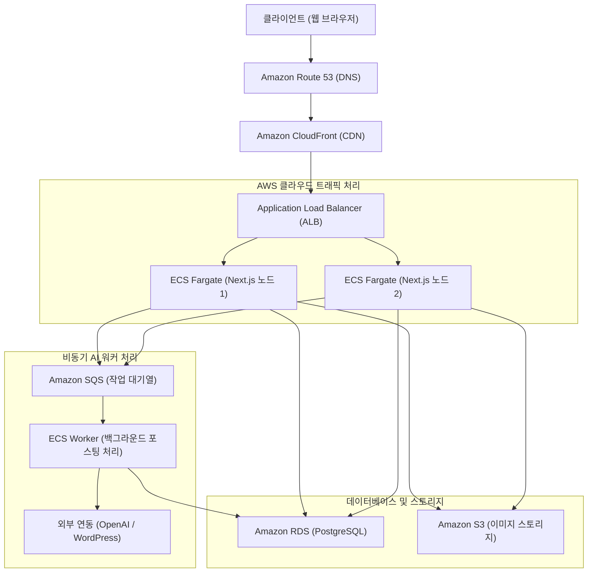

# SaaS 백엔드 아키텍처 및 AWS 배포 가이드

현재의 CP9 프로젝트를 완벽한 **SaaS(웹 기반 서비스)** 로 서비스하기 위해, AWS(Amazon Web Services)를 활용하여 백엔드를 어떻게 구성하고 배포하는지 설명하는 문서입니다.

## 1. SaaS 백엔드 구성의 핵심 개념

SaaS 환경에서 백엔드는 수천 명의 사용자가 동시에 접속하더라도 시스템이 다운되지 않도록 **확장성(Scalability)** 과 **안정성(Reliability)** 을 갖춰야 합니다.
현재 CP9은 Next.js 기반이므로 사용자 인터페이스(프론트엔드)와 API(백엔드)가 통합되어 있습니다. 이를 AWS에 올릴 때는 Docker 컨테이너로 감싸서 배포하는 방식이 가장 정석적입니다.

### 백엔드의 주요 역할
*   **멀티테넌시(Multi-tenancy) 라우팅** : 모든 HTTP 요청에서 사용자 세션을 검증하고 해당 사용자의 데이터만 반환합니다.
*   **비동기 워커(Background Worker)** : AI 글쓰기와 같은 무거운 작업은 즉시 처리하지 않고 큐(Queue) 시스템에 넣은 뒤 백그라운드에서 처리합니다.

---

## 2. [추가 제언] MVP 검증 단계: 단계별 런칭 테크트리 (비용 최소화 전략)

AWS 인프라는 정식 서비스(스케일링)를 위한 도구입니다. 아직 '혼자' 테스트 중이거나 서비스 반응을 극도로 저렴하게 확인하려면 다음의 테크트리를 단계별로 밟는 것이 절대적으로 유리합니다.

### 🐣 -1단계 (무자본 개인 테스트) : Ngrok & Vercel
*   **어울리는 유저 수**: **동시 접속자 1~10명 내외 (팀원 내부 테스트, 클라이언트 극초기 시연용)**
*   현재 내 컴퓨터(`npm run dev`)에서 도는 것을 외부에 혼자 데모로 보여주거나 테스트해야 할 때입니다. (비용 $0)
*   **프론트엔드/백엔드 (Vercel)** : 현재 Next.js 기반이므로, Github에 코드를 푸시하고 **Vercel 무료 티어(Hobby)** 에 바로 연동하면 1분 만에 `cp9.vercel.app` 같은 무료 인터넷 주소가 발급됩니다. 혼자 쓰는 용도나 데모 시연용 서버로 지구상에서 가장 빠르고 완벽한 방법입니다.
*   **데이터베이스 (Vercel 환경 무료 DB 대안 3대장)** : 내 로컬 DB를 외부에 띄우려면 서버리스 DB가 필수입니다.
    1.  **Supabase** : 가장 대표적인 오픈소스 Firebase 대안. PostgreSQL 무료 500MB를 제공하며, 인증(Auth)까지 한 번에 해결할 때 좋습니다.
    2.  **Vercel Postgres (상세로는 Neon DB)** : 현재 Vercel에서 공식 지원하는 서버리스 Postgres입니다. 가장 훌륭한 대안이며, Vercel 대시보드 내에서 스토어 탭 클릭 한 번으로 DB가 생성되고 알아서 환경 변수(`POSTGRES_URL`)까지 자동 연결되어 **"연동" 측면에서는 압도적으로 편합니다.**
    3.  **Turso (SQLite 기반)** : 최근 서버리스 생태계에서 초고속 응답 속도와 저렴한 비용으로 제일 핫한 DB입니다. 데이터 구조가 무겁지 않은 앱에 적극 추천합니다.
*   **로컬 직접 뚫기 (Ngrok)** : Vercel 배포조차 귀찮고, 그냥 지금 로컬에 띄워둔 걸 내 스마트폰이나 지인에게 당장 3초 만에 보여주고 싶다면 터미널에 `ngrok http 3000` 을 입력합니다. (내 PC가 직접 전세계 누구나 접속 가능한 임시 테스트 서버로 변신)

### 🐥 0단계 (MVP 런칭) : AWS Lightsail (월 1~2만 원)
*   **어울리는 유저 수**: **동시 접속자 10~50명 / 일일 활성 유저(DAU) 200명 이하 (MVP 클로즈 베타, 초기 얼리버드 고객 대상)**
*   초기 반응만 먼저 살피고 비용 리스크를 안고 싶지 않을 때, 처음부터 거대한 ECS나 로드밸런서를 붙이는 것은 오버엔지니어링일 수 있습니다. 이때 가장 현실적이고 훌륭한 대안이 바로 **AWS Lightsail(라이트세일)** 입니다. 
*   **Lightsail의 장점 (MVP 최적화)**:
    *   **투명한 정액제 비용**: 월 $5, $10 단위의 고정 가격으로 트래픽(대역폭), 고정 IP, SSD까지 한 번에 묶어서(Bundle) 빌려줍니다. 트래픽 폭탄으로 인한 '요금 폭탄' 걱정이 전혀 없습니다.
    *   **극강의 단순함**: 버튼 몇 번이면 우분투(Ubuntu) 혹은 Node.js 환경이 세팅된 깡통 서버가 완성됩니다. 그 안에 내 VCL/Front 코드를 통째로 넣고 `pm2` 로 돌리기만 하면 끝납니다. DB 역시 Lightsail 전용 내장 관리형 DB(월 $15)를 쓰면 클릭 한 번으로 끝납니다.
*   **Lightsail의 단점 (왜 영원히 쓸 수는 없는가?)**:
    *   **오토스케일링 불가**: 사용자가 갑자기 1천 명 접속하면, 서버 사양을 높이거나 옆으로 늘리는(Scale-out) 것이 유연하지 않아 서버가 그대로 터집니다.
    *   **단일 실패 지점**: 메인 서버 한 대가 멈추면 SaaS 서비스 전체가 그대로 중단됩니다.

### 🦅 1단계 (정규 SaaS 런칭) : ALB + ECS Fargate + RDS (월 10만 원+)
*   **어울리는 유저 수**: **동시 접속자 100명 ~ 무한대 / 일일 활성 유저(DAU) 1,000명 이상 (정식 결제 오픈, 공개 마케팅 시작점)**
*   입소문을 타서 사용자가 감당 안 되게 몰리는 "행복한 비명"이 터지는 시점에, 데이터베이스 베이스를 복사해서 본편인 Fargate 백엔드 아키텍처로 넘어가면 자동 스케일링을 통해 수만 명의 트래픽을 방어할 수 있습니다.
*   **전략 결론**: 
    1. 처음 MVP 런칭 후 유료 결제자가 50명~100명 미만일 때는 **월 1~2만 원 따리의 Lightsail**로 가볍게 시장 반응을 검증하세요. 
    2. 입소문을 타서 사용자가 감당 안 되게 몰리는 "행복한 비명"이 터지는 시점에, 데이터베이스만 빼서 본편인 인프라(Fargate + ALB)로 이사하는 것이 가장 똑똑한 사업화 테크트리입니다.

### 💰 [수치 비교] MVP(Lightsail) vs 정규 SaaS(ECS/Fargate) 초기 유지비
ECS 기반 정규 아키텍처는 거센 트래픽 폭풍에 대비하는 '요새'를 짓는 것이기 때문에, 접속자가 단 1명도 없어도 무조건 지불해야 하는 **"기본 문지기 비용(ALB 로드밸런서, RDS 등)"** 이 높습니다. 반면 Lightsail은 원룸 월세처럼 모든 게 포함된 정액제입니다.

1.  **MVP (AWS Lightsail) : 월 약 $10 ~ $20 (한화 약 1.3만 원 ~ 2.6만 원)**
    *   앱 배포용 Node.js 깡통 서버 1대: **월 $5 ~ $10** (2GB RAM, 트래픽 2~3TB 무료 포함)
    *   (선택) Managed Database 1대: **월 $15** (백업 지원) 
    *   로드밸런서: 필요 없음 (단일 서버 트래픽이므로)

2.  **정규 SaaS (ALB + ECS Fargate + RDS) : 최소 월 약 $60 ~ $100+ (한화 약 8만 원 ~ 13만 원 이상 시작)**
    *   ALB (로드밸런서, 트래픽 분배기 겸 문지기): 켜두기만 해도 **월 약 $16 ~ $20 기본 빌링**.
    *   ECS Fargate 컨테이너 1대 (0.25 vCPU / 0.5GB RAM 기준 24시간 가동 시): **월 약 $8 ~ $10**.
    *   RDS (관리가 편한 프로덕션급 Postgres DB 최소 사양): **월 최소 $20 ~ $35**.
    *   NAT 게이트웨이 / 프라이빗 네트워크 등 보안 구성 시: **월 약 $30 추가 과금**.

> **결론 수치**: 정규 SaaS 뼈대를 AWS 원시 서비스들(ALB, ECS, RDS)로 정석대로 세팅하면, **사용자가 0명이든 1,000명이든 숨만 쉬어도 매달 최소 10만 원 안팎의 클라우드 유지비**가 빠져나갑니다. 반면 **Lightsail은 커피 두 잔 값(월 1만 원대)** 으로 동일한 초기 코드를 돌릴 수 있습니다. 자본이 한정된 MVP 극초기엔 Lightsail이 압도적으로 유리합니다.

### 🚨 [비상 대응] 트래픽 폭주 시 Lightsail ➡️ 정규 SaaS 이사 전략 (Migration)
사용자가 폭주하여 Lightsail 인스턴스가 버벅대기 시작할 때, 가장 안전하게 정규 인프라(Fargate + ALB)로 넘어가기 위한 **무중단(또는 최소 중단) 이사 스크립트**는 다음과 같습니다.

1.  **D-1 (물밑 작업): 본편 인프라 구축 (기존 서버 유지)**
    *   사용자들은 여전히 불안정하지만 기존 Lightsail 서버를 쓰게 둡니다. (절대 먼저 끄면 안 됩니다.)
    *   개발자는 모르게 뒤(Background)에서 정규 인프라(ALB + ECS Fargate + RDS) 뼈대를 모두 세팅하고 최신 코드를 띄워놓습니다.
2.  **D-Day 새벽: 서비스 1시간 점검 공지 (최소 중단)**
    *   새벽 3시 등 트래픽이 가장 적은 시간에 웹사이트에 "더 나은 환경을 위한 긴급 서버 증설 점검(1시간)" 공지창을 띄우고 Lightsail 웹 접근을 차단하여 신규 데이터 쓰기를 막습니다.
3.  **데이터 마이그레이션 (DB 복사)**
    *   접속이 차단된 상태에서(데이터 오차가 발생하지 않도록) 최신 상태의 Lightsail 내장 데이터베이스(DB) 데이터를 덤프(복사) 떠서, 새로 만든 최고급 AWS RDS 데이터베이스로 그대로 밀어 넣습니다.
4.  **DNS 스위칭 (주소표 교체)**
    *   가비아나 AWS Route 53에서 `cp9.com` 주소가 가리키던 곳을 '기존 Lightsail IP'에서 '새로 만든 ALB 로드밸런서 주소'로 바꿔치기합니다. (DNS 전파 시간 동안 점검 창 유지)
5.  **점검 해제 및 구 서버 폐기**
    *   점검 공지를 내립니다. 사용자들은 어제와 똑같은 주소로 들어오지만, 이제 트래픽은 허약한 Lightsail이 아닌 **거대한 Fargate(자동 스케일링 요새)** 로 흘러 들어갑니다.
    *   2~3일 정도 모니터링하여 에러가 없음을 확인한 뒤, 기존 Lightsail 월 1만 원짜리 서버를 영구 삭제(Terminate)합니다.

---

## 2. AWS 배포 방식 (어떻게 올릴 것인가?)

로컬에서 `npm run dev` 로 실행하던 코드를 AWS 제품군을 조합하여 프로덕션 레벨로 격상시킵니다.

1.  **배포 패키징** : 코드를 Docker 이미지로 빌드합니다.
2.  **컨테이너 레지스트리** : 빌드된 이미지를 **Amazon ECR(Elastic Container Registry)** 에 푸시합니다.
3.  **컴퓨팅 환경 구성** : 서버(EC2)를 직접 관리하지 않도록, 컨테이너만 실행해주는 **AWS Fargate(ECS)** 를 사용합니다.
4.  **트래픽 분산** : 사용자가 몰릴 경우 Fargate 컨테이너 개수를 자동으로 늘리고(Auto Scaling), 들어오는 트래픽을 골고루 분산시켜주는 **ALB(Application Load Balancer)** 를 앞에 배치합니다.

> [!NOTE] 
> **Q. 그냥 EC2 서버 인스턴스 하나 빌려서 구축하거나, EC2도 오토스케일링(ASG) 그룹 묶어서 쓰면 안 되나요?**
> A. 물론 가능합니다! 사실 예전에는 네이버, 넷플릭스 등 대기업들도 다 EC2 서버들의 오토스케일링으로 버텼습니다. 
> 하지만 EC2(가상 머신, VM) 스케일링과 **ECS/Fargate(컨테이너) 스케일링**은 SaaS 운영 관점에서 명확한 차이가 존재합니다:
> 
> 1. **확장 반응 속도 (Boot Time)**: 
>   - **EC2 오토스케일링**: 트래픽이 몰려서 "서버 1대 추가해!"라고 명령하면, 가벼운 리눅스라 하더라도 OS 부팅부터 시작해서 Node.js 설치, 환경 변수 세팅 등 진짜 '컴퓨터 부팅' 과정이 필요하므로 트래픽 파도를 맞고 나서 최소 수 분(Minutes)이 걸립니다.
>   - **ECS(컨테이너)**: OS 부팅 과정이 생략된 가벼운 컨테이너 박스만 켜는 것이기 때문에, 수 초(Seconds) 안에 새 노드가 켜지며 즉각 트래픽 방어가 가능합니다.
> 2. **유휴 자원 낭비 (Bin Packing)**: 
>   - **EC2**: 서버 1대를 통째로 빌리는 것이므로 메모리를 20%만 쓰든 80%를 쓰든 인스턴스 렌탈 비용 전체를 지불해야 합니다.
>   - **컨테이너화(ECS)**: 애플리케이션의 덩치에 딱 맞는 가상의 컨테이너 여백만 쓰고 그만큼만 결제하면 돼서 (Fargate 모델), 테트리스처럼 자원에 빈틈이 남지 않습니다.
> 3. **서버 인프라 관리의 종말 (Serverless)**: 
>   - EC2 관리 시 필수였던 주기적인 OS 커널 보안 패치, 리눅스 서버 접속(SSH) 권한 키 관리, 로그 로테이션 등의 관리 요소를 지워버리고 오직 **"내 Next.js 코드만 신경 쓰게(Fargate 등 서버리스)"** 만들어 주기 때문에, 1~2명의 인력으로 움직이는 스타트업이나 초기 SaaS에서 인건비를 급격하게 덜어줍니다.

---

## 3. SaaS AWS 아키텍처 다이어그램 (Mermaid)

다음은 전형적인 웹 기반 SaaS의 AWS 인프라 구성도입니다.

---

## 4. 백엔드 구성 요소별 상세 역할

### (1) Amazon ECS Fargate **(메인 백엔드)** 
*   **역할** : 로그인 처리, 결제 검증, 사용자 설정 저장 등 일반적인 API 요청을 처리합니다.
*   **장점** : 트래픽이 몰리면 자동으로 컨테이너 서버 개수를 2개, 3개로 늘려 대응할 수 있습니다.
*   **Fargate란? (서버리스 컨테이너)** : 
    - 예전처럼 서버(EC2 화물선)를 통째로 빌려서 개발자가 배를 수리하고 OS를 관리하는 방식이 아니라, **"먼 곳의 관문(Far Gate)"에 내 도커(Docker) 코드 박스만 던지면 AWS가 하위 서버 관리를 모두 대행해서 알아서 실행시켜주는 혁신적인 서버리스(Serverless) 기술**입니다. 오직 내 코드가 필요로 하는 RAM/CPU 덩치만큼만 결제하면 됩니다.
*   **비용 구조 (EC2 vs Fargate)**:
    - **EC2 비용**: 24시간 내장된 CPU와 RAM이 고정된 '서버 공간' 전체를 월세 내듯 빌립니다. 새벽에 아무도 접속하지 않아 리소스가 90% 이상 남아돌아도 **24시간 고정 비용이 100% 발생**합니다.
    - **Fargate 비용**: 실행되는 컨테이너가 각 할당받은(요청한) vCPU와 메모리에 대해 **'초(Second) 단위'로 과금**됩니다. 따라서 "평소에는 아주 가벼운 컨테이너 1대분(몇천 원)만 띄워두다가, 스케줄링 이벤트가 터지는 특정 30분 동안만 10대로 확 늘어났다 줄어드는" 방식으로 낭비를 원천 차단하여 비용을 최적화할 수 있습니다. 반면, 만약 트래픽이 24시간 내내 풀가동 수준으로 빡빡하다면 오히려 Fargate의 단가가 EC2 정액제보다 비쌀 수 있습니다.

### (2) Amazon SQS 및 Worker **(비동기 큐 시스템)** 
*   **역할** : 사용자가 "글쓰기 100개 시작" 버튼을 눌렀을 때, API 서버가 멈추지 않도록 **Amazon SQS(대기열)** 에 작업표를 넣습니다. 그러면 별도의 Worker(작업자) 서버가 이 대기열표를 하나씩 꺼내서 OpenAI API를 호출하고 WordPress에 업로드합니다.
*   **이점** : AI 응답 지연으로 인한 서버 타임아웃 문제를 해결합니다.

### (3) Amazon RDS **(데이터베이스)** 
*   **역할** : SaaS 사용자의 핵심 데이터(결제 내역, 포스팅 기록, 설정 정보 등)를 안전하게 영구 보관합니다. 주기적인 자동 백업과 다중 가용영역 배포를 통해 데이터 유실을 방지합니다.

이와 같은 아키텍처를 구성하면 트래픽 방어, 무정단 배포(Zero-downtime Deployment), 비동기 배치 처리가 모두 가능해지는 진정한 **SaaS(웹 앱)** 벡엔드를 갖추게 됩니다.
