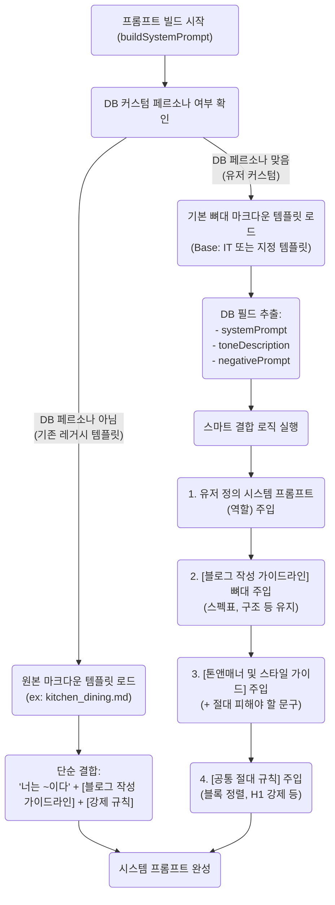

# 오토파일럿 & 페르소나 템플릿 주입 아키텍처

본 문서는 사용자가 커스텀한 페르소나가 기존 유지되던 '쿠팡 파트너스 최적화 블로그 템플릿(Markdown)'과 어떻게 결합하여 최종 LLM 프롬프트로 생성되는지 그 구조와 흐름을 설명합니다.

## 1. 아키텍처 개요

기존에는 하드코딩된 시스템 페르소나('IT', '뷰티' 등)에 1:1로 매핑된 마크다운 템플릿 파일(`seo-article-writer/references/...`)을 불러와 곧바로 프롬프트로 사용했습니다. 
하지만 유저 주도형 **커스텀 페르소나(DB)** 시대가 열리면서, 유저가 작성한 '시스템 프롬프트'와 '톤앤매너'를 존중하되, 기존 쿠팡 파트너스 글의 뼈대(스펙 비교표, 장단점 요약, CTA 등)를 유지해야 하는 과제가 생겼습니다.

이에 따라 **템플릿 결합(Template Injection)** 아키텍처를 도입하여, 사용자의 개성과 시스템의 구조적 강제성을 모두 달성합니다.

---

## 2. 프롬프트 생성 흐름도 (Mermaid)

다음은 `article-phase.ts` 내에서 `buildSystemPrompt`가 어떻게 구성되는지 보여주는 흐름도입니다.



---

## 3. 핵심 기술 요소 (Technical Specs)

### 3.1. `seo-skill-parser.ts` 
- 역할: 파일 시스템(`.agents/skills/seo-article-writer/references/`)에 존재하는 원본 마크다운 템플릿을 읽어옵니다.
- 특징: 프롬프트 내용 중 `2024년` 등으로 하드코딩된 과거 텍스트를 현재 연도(`${currentYear}년`)로 동기화하는 정규식 처리가 포함되어 있어, 프롬프트 시효 만료를 방지합니다.

### 3.2. `article-phase.ts` 내 `buildSystemPrompt` 로직 변경
과거 발생했던 **"페르소나 적용 시 쿠팡 블로그 폼이 망가지는 현상"** 은 커스텀 페르소나가 감지되었을 때 마크다운 템플릿(`personaTemplate`) 자체를 로드하지 않고 누락했기 때문입니다.
이를 개선하여 아래와 같이 **강제 주입(Injection)** 방식을 적용했습니다.

```typescript
// 개선된 로직 요약
const templateFile = PERSONA_TEMPLATE_FILE[ctx.persona] || PERSONA_TEMPLATE_FILE['IT'];
const personaTemplate = await getSeoSkillTemplate(templateFile);

if (ctx.personaSystemPrompt || ctx.personaToneDesc) {
  // 사용자의 커스텀 역할/톤앤매너 존중
  const sysPrompt = ctx.personaSystemPrompt;
  const toneDesc = ctx.personaToneDesc;
  
  return \`
    \${sysPrompt} // 유저가 설정한 역할
    
    [블로그 작성 가이드라인]
    \${personaTemplate} // 원본 마크다운 템플릿 강제 주입 (스펙 비교표 유지)
    
    [톤앤매너 및 스타일 가이드]
    \${toneDesc} // 유저가 설정한 말투 유지
  \`;
}
```

## 4. 기대 효과 및 검증(Verification) 포인트
1. **자유도와 구조의 완벽한 결합**: 유저는 "깐깐한 40대 맘카페 유저"라는 역할만 부여해도, 시스템이 알아서 쿠팡 최저가 버튼과 마크다운 스펙 비교표를 알맞은 위치에 생성해냅니다.
2. **이탈률 방지 (Safe Fallback)**: 유저가 필수적인 프롬프트를 지워버렸더라도 `personaTemplate`이 뼈대를 강제하므로 에러 없는 마크다운 코드가 생성됩니다.
3. **검증 방법**:
   - 오토파일럿 대시보드나 키워드 생성 시 "IT (복제됨)" 등 커스텀 페르소나를 선택하고 글을 생성해봅니다.
   - 결과물에서 1) 유저가 수정한 톤앤매너가 반영되었는지, 2) H2, H3, 테이블, CTA 등 기본 포맷이 훼손되지 않고 원본처럼 유지되는지 확인합니다.
