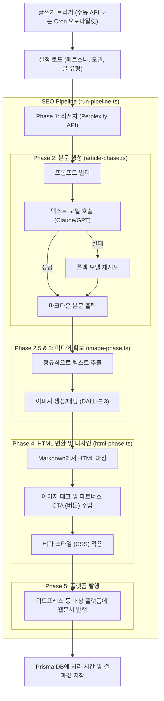

# 📝 글쓰기 파이프라인 (SEO Pipeline) 핵심 로직 요약

글쓰기 핵심 로직은 `src/app/api/item-research/pipeline/run-pipeline.ts` 파일에서 전체 파이프라인을 관장하며, 각 단계는 다음과 같이 동작합니다.

### Phase 1: 브레인스토밍 및 리서치 (research-phase.ts)
- 타겟 상품이나 키워드에 대해 Perplexity API를 호출하여 최신 정보와 스펙, 장단점 등의 리서치 데이터를 확보합니다.

### Phase 2: LLM 본문 작성 (article-phase.ts)
- **프롬프트 합성**: 선택된 페르소나(DB 또는 기본), 글 유형(개별 리뷰, 비교 분석, 큐레이션 리스트, 키워드 모드)에 따라 **"시스템 프롬프트"** 와 **"사용자 프롬프트"** 를 동적으로 생성합니다.
- **본문 생성**: 지정된 텍스트 모델(예: Claude/GPT 등)을 호출하여 마크다운(Markdown) 포맷의 블로그 포스팅 초안을 작성합니다. (실패 시 폴백 모델 재시도)
- **이미지 기획**: 본문 내에 `[이미지 제안: xxx]` 형태의 텍스트 태그를 삽입하도록 유도합니다.

### Phase 2.5 & 3: 미디어 확보 (image-phase.ts)
- 앞서 생성된 본문을 정규식으로 분석하여 `[이미지 제안: xxx]` 텍스트를 모두 추출합니다.
- 추출된 제안들을 바탕으로 이미지 생성 모델(DALL-E 3 등)을 사용해 이미지를 확보하거나 상품 썸네일을 준비합니다.

### Phase 4: HTML 변환 및 디자인 주입 (html-phase.ts)
- 마크다운 본문을 HTML로 변환합니다.
- 본문 내 `[이미지 제안: xxx]` 부분을 실제 생성된 이미지 태그로 치환(Replace)합니다.
- 쿠팡 파트너스 CTA(구매 유도 링크/버튼)를 텍스트 흐름에 맞게 주입하고, DB에 설정된 테마 디자인(스타일시트)을 적용합니다.

### Phase 5: 다중 플랫폼 자동 발행 (wordpress-phase.ts)
- 완성된 최종 HTML 포스팅을 워드프레스(WordPress) 등의 타겟 플랫폼 API를 통해 자동 발행합니다.
- 작업 완료 후 소요 시간, 사용 모델, 포스트 URL 등의 결과를 데이터베이스(Prisma)에 저장합니다.

---

## 📊 글쓰기 프로세스 아키텍처 다이어그램

아래는 위 로직을 한눈에 확인할 수 있는 데이터 흐름 순서도(다이어그램)입니다.

> [!NOTE]
> 글 작성 방식(글 유형)에 따라 `article-phase.ts` 내부의 **사용자 프롬프트** 구성 로직이 디테일하게 나뉘며(`buildSinglePrompt`, `buildComparePrompt`, `buildCurationPrompt`, `buildKeywordPrompt`), 이는 프롬프트 엔지니어링을 통해 결과물의 구조를 통제하는 핵심 역할을 맡고 있습니다.
