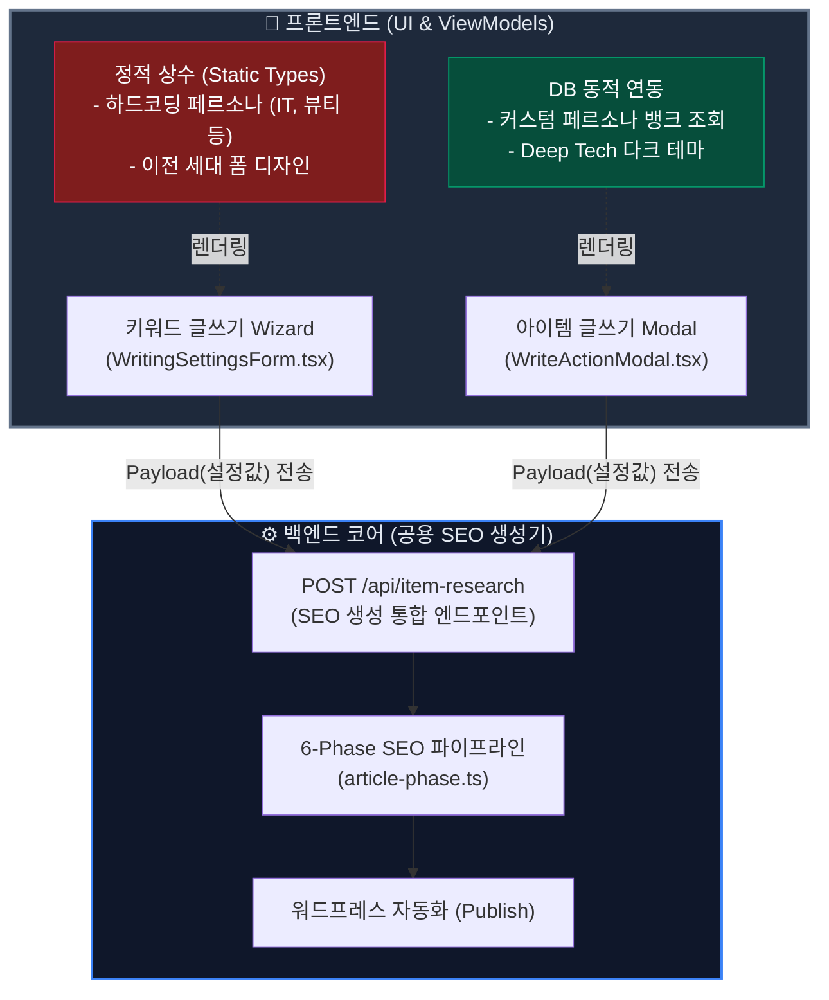

# 📝 글쓰기 포맷 차이점 분석 및 통일화 계획 보고서

## 1. 개요 및 왜 디자인과 포맷이 다를까?

**키워드 글쓰기(KeywordWriting)** 화면과 **아이템 생성 글쓰기(WriteActionModal)** 화면은 동일한 "AI 검색 -> 글 생성"이라는 목적을 갖고 있지만, 현재 설정 뷰 템플릿과 데이터 소스가 분리되어 있습니다. 설계 단계가 각기 달랐기 때문입니다.

1. **아이템 생성 (WriteActionModal)**
   - **데이터 소스**: 가장 최근 구현된 기능으로 **DB(`Persona` 테이블)**와 연동되어 있습니다 (사용자 커스텀 페르소나 선택 가능).
   - **UI/UX**: 최신 컨셉인 **Deep Tech 다크 테마**(글래스모피즘, 네온 파티클 효과, 컴팩트 그리드 레이아웃)로 업데이트되었습니다.
   - **상태**: 최신 오토파일럿 대시보드와 유기적으로 결합되어 있습니다.

2. **키워드 글쓰기 (`WritingSettingsForm`)**
   - **데이터 소스**: 기능 개발 초기(Legacy)에 작성된 **정적 데이터(`PERSONA_OPTIONS` 상수)**를 그대로 사용 중입니다.
   - **UI/UX**: 이전 버전의 스탠다드 형태 폼 디자인을 유지 중입니다.

다만 본질적으로 **글을 최종 생성하는 백엔드 처리(SEO Pipeline)** 모듈은 두 기능이 **100% 동일하게 공유**하고 있습니다. 이는 프론트엔드의 컴포넌트(`WritingSettingsForm`)만 최신 모델(`WriteActionModal`의 설정 방식)로 리팩토링 및 덮어씌움으로써 쉽게 해결할 수 있습니다.

---

## 2. 데이터 흐름 다이어그램 (현재 상태)

---

## 3. 통일화 (Unification) 및 리팩토링 계획

프론트엔드에서의 UX 불일치를 해결하고 통일된 환경을 사용자에게 제공하기 위해 아래 3가지 조치를 수행합니다.

### 📍 프론트엔드 교체 작업 내용
1. **페르소나 연동 방식 마이그레이션**:
   - 기존에 정적 배열(`PERSONA_OPTIONS`)을 읽어오던 `useKeywordWritingViewModel` 훅 내부를 수정하여, 어드민에서 생성한 **DB 페르소나 (`usePersonaViewModel`)**를 가져오게 변경합니다.
   
2. **UI 뷰(View) 디자인 교체**:
   - `WritingSettingsForm.tsx` 컴포넌트 내부의 디자인을 `WriteActionModal`에서 작성했던 **"Deep Tech Card + Inner Glow + 1px Shadow 디자인"**으로 1:1 이식합니다.
   - 글 유형(단일/비교/큐레이션) 및 톤앤매너 설정 영역도 짙은 네이비 배경과 푸른색 활성 테마로 마이그레이션합니다.

3. **입력 페이로드 통일 검증**:
   - 백엔드에 보내는 `POST /api/item-research` 요청의 Payload 자료구조는 이미 동일하므로, 새 디자인 폼을 선택했을 때 값이 정상적으로 바인딩(Binding)되는지만 검수합니다.

이 작업이 완료되면 사용자는 "어떤 메뉴(아이템 생성 vs 키워드 글쓰기)로 진입하든" 동일하게 **자신이 만든 페르소나 봇**을 최신 디자인 화면에서 선택하여 글을 발행할 수 있게 됩니다.
