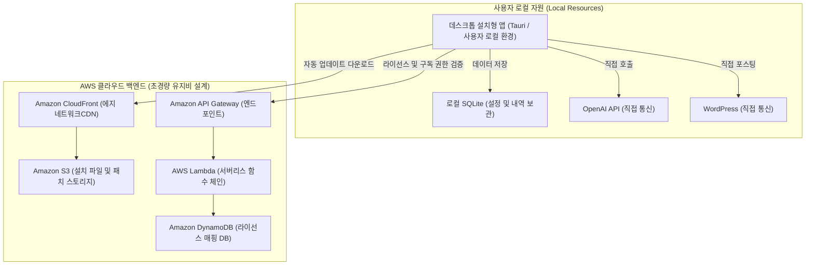

# 데스크톱(Tauri) 앱 백엔드 아키텍처 및 AWS 배포 가이드

프론트엔드를 **Rust(Tauri)** 프레임워크로 감싸서 설치형 데스크톱 웹앱(Mac `.dmg`, Windows `.exe`)으로 배포할 때, 백엔드의 역할과 이를 처리하기 위한 AWS 구성 전략을 설명하는 문서입니다.

## 1. 데스크톱 앱에서 백엔드의 개념 변화

SaaS 환경에서는 서버가 "모든 것(데이터 저장, 연산, API 통신)"을 담당했습니다. 하지만 데스크톱 앱으로 패키징하면 주요 연산을 **사용자의 로컬 PC(클라이언트 자원)** 에서 수행하게 됩니다.

따라서 데스크톱 방식에서 **백엔드(클라우드 서버)** 의 역할은 다음과 같이 매우 가벼워집니다.
*   **주요 데이터(Data)** : 사용자의 로컬 PC 내장 SQLite 등을 사용하여 저장합니다.
*   **주요 통신(API)** : 서버를 거치지 않고, 로컬 앱 안에서 직접 외부 API(OpenAI, WordPress)와 통신합니다.
*   **클라우드 백엔드의 본질** : 오직 **"라이선스 키 검증"**, **"소프트웨어 자동 업데이트 배포"**, **"핵심 설정 템플릿 동기화"** 정도만 서버에서 처리하면 됩니다.

---

## 2. AWS 배포 방식 (서버리스 지향)

데스크톱 앱 모델에서는 무거운 EC2 컨테이너 서버를 계속 열어둘 필요가 없습니다. 요청이 올 때만 잠깐 켜져서 동작하는 **서버리스(Serverless)** 가 가장 기술 가성비가 높은 선택입니다.

1.  **앱 인스톨러 배포** : 빌드된 설치 파일은 **Amazon S3** 에 저장하여 외부로 배포합니다.
2.  **API 구성 구성** : 라이선스 인증이나 로그인 등의 가벼운 함수 호출은 **AWS API Gateway** 와 **AWS Lambda** 를 묶어서 구축합니다.
3.  **데이터베이스 구성** : 복잡한 RDBMS 대신 가벼운 키-값 쌍(Key-Value) 구조인 **Amazon DynamoDB** 를 사용하여, '이 라이선스 키가 유효한지' 여부만 빠르게 조회합니다.

---

## 3. 데스크톱(Tauri) 모델 AWS 아키텍처 다이어그램 (Mermaid)

다음은 개인 PC에 설치된 클라이언트와 가벼운 AWS 백엔드가 통신하는 구조도입니다.

---

## 4. 백엔드 구성 요소별 상세 역할

### (1) Amazon S3 + CloudFront **(배포 및 업데이터)** 
*   **역할** : 사용자가 앱 설치 파일을 다운로드하거나, 프로그램 켤 때 백그라운드에서 백그라운드 Auto-Updater(패치 파일 적용)를 통해 새 버전을 받아오는 스토리지 공간입니다. 가장 저렴한 비용으로 전 세계 어디서든 빠른 다운로드 속도를 보장합니다.

### (2) Amazon API Gateway + AWS Lambda **(서버리스 인증 백엔드)** 
*   **역할** : 데스크톱 앱을 처음 실행할 때, "내가 돈을 낸 사람인지" 라이선스 키를 입력하면 이를 검증하는 **인증 초소 파수꾼 역할** 을 합니다. 기존 배포처럼 컴퓨터 리소스를 상시 띄워둘 필요 없이 실행된 응답(ms 단위)만큼만 과금되므로, 월 1만 원 이하로 수만 명의 사용자 인증 검증을 방어할 수 있습니다.

### (3) Amazon DynamoDB **(라이선스 데이터 세트)** 
*   **역할** : 관계형 데이터베이스(Postgres/MySQL)가 수행하던 역할 대신, "사용자 이메일 - 라이선스 고유 식별 키" 등의 단순 매칭 정보만 담습니다.

결론적으로 데스크톱(Tauri) 방식은 **개발의 무게중심이 "클라이언트(로컬 내 API 직접 호출 및 로컬 로직 관리)"로 이전** 하기 때문에, AWS 백엔드 유지보수에 대한 인건비와 클라우드 인프라 지출을 비약적으로 아낄 수 있습니다.
