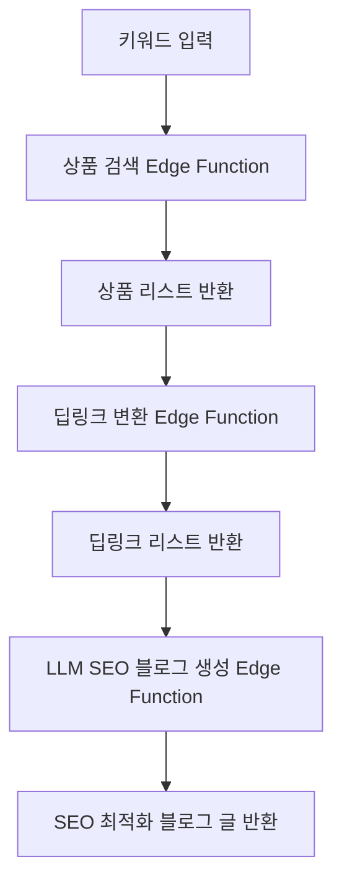

# 🛠️ Coupang Partners Auto-Blog SaaS

## 비즈니스 로직/아키텍처

1. **키워드 입력**
   - 사용자가 키워드를 입력하면, 관련 상품을 자동으로 선별합니다.
2. **쿠팡 파트너스 딥링크 변환**
   - 선별된 상품의 URL을 쿠팡 파트너스 전용 딥링크로 일괄 변환합니다.
3. **SEO 최적화 블로그 글 자동 작성**
   - LLM(OpenAI 등)을 활용해 SEO에 맞는 블로그 글을 자동으로 생성합니다.

### 전체 플로우

### 기술 스택
- **프론트엔드**: Next.js 15, Zustand, TanStack Query, shadcn/ui
- **백엔드**: Supabase Edge Functions (TypeScript), OpenAI API
- **DB**: Supabase Postgres (키워드, 상품, 블로그 글 저장)
- **API 연동**: 쿠팡 파트너스 상품검색/딥링크 API, OpenAI

### API/Edge Function 설계
1. **상품 검색**
   - `POST /api/products/search`
   - 입력: `{ keyword: string }`
   - 출력: `[ { title, image, price, url, ... } ]`
2. **딥링크 변환**
   - `POST /api/products/deeplink`
   - 입력: `{ urls: string[] }`
   - 출력: `[ { originalUrl, deepLink } ]`
3. **블로그 글 생성**
   - `POST /api/blog/generate`
   - 입력: `{ keyword: string, products: Product[], deepLinks: DeepLink[] }`
   - 출력: `{ html: string, markdown: string }`

---

## 개발 단계

- [ ] 상품 검색 Edge Function 구현
- [ ] 딥링크 변환 Edge Function 구현
- [ ] SEO 블로그 자동생성 Edge Function 구현
- [ ] 프론트엔드 통합 및 UI/UX 개선
