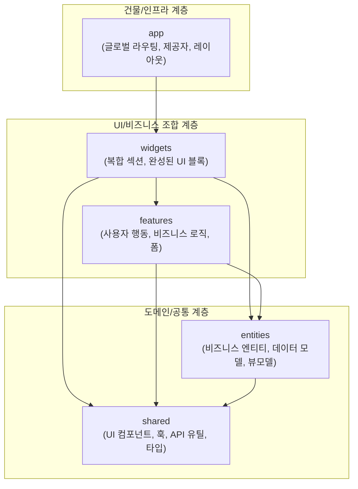
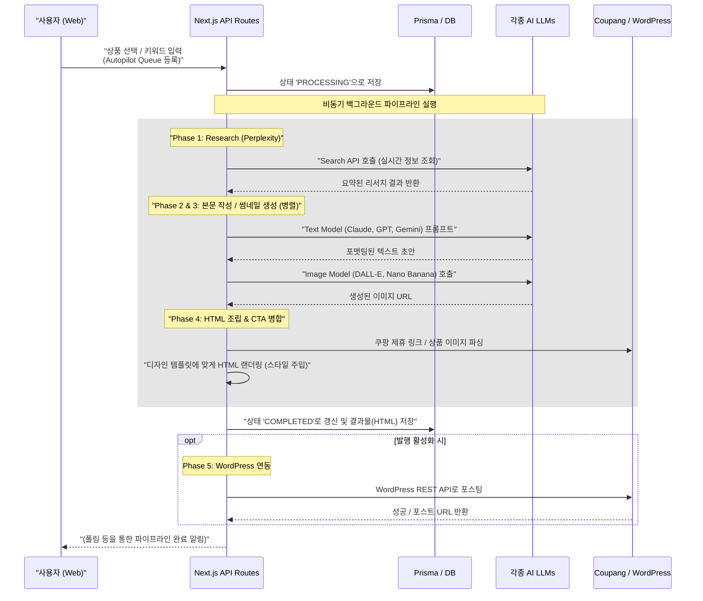

# CP9 Frontend (SEO Article Generation Platform)

CP9은 **AI 다중 모델(OpenAI, Anthropic, Gemini)**과 자체 설계된 **SEO 최적화 생성 파이프라인**을 활용하여 단일 상품 리뷰, 다중 상품 비교, 상품 큐레이션 글을 자동으로 생성하고 배포(WordPress)하는 고도화된 웹 애플리케이션입니다.

## 🚀 Key Features

*   **다중 모델 프롬프팅 (Multi-Model LLM):** GPT-4o, Claude 3.5/4.6 Sonnet, Gemini Pro, Perplexity (최신 정보 검색) 등 목적에 맞게 AI 모델을 조합하여 사용.
*   **고급 파이프라인 엔진 (SEO Pipeline):** 상품 검색 → AI 제목 추천(의도 분석) → 본문 및 이미지(Nano Banana 2, DALL-E) 병렬 생성 → HTML 템플릿 주입 → 워드프레스 발행까지의 전자동화된 흐름(Autopilot) 제공.
*   **디자인 템플릿 (Design Tokens):** 딥테크/미니멀 등 다양한 UI/UX 컨셉의 디자인 토큰을 활용하여 본문 삽입형 CTA(Call To Action) 및 비교 표(Table) 등의 HTML 컴포넌트를 이쁘게 생성.
*   **오토파일럿 (Autopilot):** 여러 개의 키워드를 동시에 등록하고 지정된 주기에 맞춰 스케줄링하여 대량의 글을 자동으로 생성 및 관리.
*   **사용자 관리 및 마이페이지:** 페르소나, 목표 글자수, API Key 연동(Supabase, WordPress, Langfuse) 및 간편 설정(Quick Presets) 관리.

---

## 🛠 Tech Stack

*   **Framework:** Next.js 15 (App Router, Turbopack)
*   **Library:** React 19, Framer Motion, Radix UI
*   **Styling:** TailwindCSS v4, SASS/CSS Modules (Deep Tech Aesthetic)
*   **State Management:** Zustand, SWR
*   **Database / Form:** Prisma, Supabase, React Hook Form
*   **AI Integration:** Langchain, Langchain Google/OpenAI/Anthropic, Langfuse (추적/로깅)

---

## 🏗 Architecture (Feature-Sliced Design, FSD)

본 프로젝트는 애플리케이션의 복잡도를 제어하고 확장성을 보장하기 위해 **FSD (Feature-Sliced Design)** 아키텍처 패턴을 차용하고 있습니다.


```mermaid
graph TD
    subgraph "건물/인프라 계층"
        A["app<br>(글로벌 라우팅, 제공자, 레이아웃)"]
    end

    subgraph "UI/비즈니스 조합 계층"
        B["widgets<br>(복합 섹션, 완성된 UI 블록)"]
        C["features<br>(사용자 행동, 비즈니스 로직, 폼)"]
    end

    subgraph "도메인/공통 계층"
        D["entities<br>(비즈니스 엔티티, 데이터 모델, 뷰모델)"]
        E["shared<br>(UI 컴포넌트, 훅, API 유틸, 타입)"]
    end

    A --> B
    B --> C
    B --> D
    B --> E
    C --> D
    C --> E
    D --> E
```

### Directory Structure (`src/` 중심)

*   **`app/`**: Next.js App Router 기반의 페이지 및 API 엔드포인트 정의. 글로벌 레이아웃, 에러 핸들링, 라우팅이 포함됩니다. (명령은 대부분 Server Component)
*   **`widgets/`**: 여러 Feature와 Entity를 묶어 화면의 큰 덩어리를 구성합니다. (예: `AutopilotDashboard`, `ProductCreationWidget`, `ThemeSettingsForm`)
*   **`features/`**: 구체적인 사용자 상호작용 및 비즈니스 로직 단위입니다. (예: 상품 검색, 글쓰기 모달, 간편 설정 로직, 페르소나 선택)
*   **`entities/`**: 독립적인 비즈니스 도메인 규칙 단위입니다. 백엔드 상태 관리(Zustand) 혹은 데이터 패칭(SWR/ViewModel)을 담당합니다. (예: `product`, `autopilot-queue`, `user-settings`)
*   **`shared/`**: 프로젝트 전반에서 재사용되는 범용적인 UI 컴포넌트(버튼, 모달, 아이콘), 유틸리티 함수, 공통 타입 등이 위치합니다.
*   **`infrastructure/`**: 외부 API 연동 클라이언트 설정 및 싱글톤 인스턴스 (Prisma, Supabase, Perplexity, Coupang API, Langfuse 설정).

### 💡 FSD 계층별 비유 (Analogy)

각 계층의 역할 구조가 헷갈릴 때 다음 비유를 떠올려 보세요:

*   🏢 **`app/` (건물 전체 뼈대 및 출입구)**: 애플리케이션의 핵심 인프라(라우팅, 전역 설정)이자 시작점입니다.
*   🛋️ **`widgets/` (쇼룸에 전시된 완성형 인테리어 룸)**: 부품(`entities`)과 스위치(`features`)를 조립하여 사용자에게 보여주는 커다란 완성 화면 복합체입니다.
*   🎛️ **`features/` (리모컨 / 전등 스위치)**: 사용자가 버튼을 눌러 상태를 변경하고 동작을 지시하는 등, 능동적인 상호작용과 비즈니스 로직을 수행합니다.
*   🧱 **`entities/` (재료 및 설계 도면)**: 벽돌, 선반 그 자체로서, 데이터의 구조를 뜻하며 스스로 동작하지 않고 제공된 데이터를 렌더링하기만 하는 순수 UI(Dumb Component)의 모음입니다.
*   🧰 **`shared/` (범용 도구 상자)**: 망치나 드라이버처럼 어느 프로젝트에서든 흔하게 꺼내 쓸 수 있는 가장 기초적이고 범용적인 유틸리티 및 공통 컴포넌트입니다.

---

## 🌊 SEO 파이프라인 워크플로우 (Pipeline Workflow)

해당 시스템은 크게 키워드/제품 데이터 입력에서 시작하여, 내부적으로 각 Phase(단계)를 거쳐 최종 콘텐츠가 탄생하는 모듈화된 프로세스를 거칩니다.


```mermaid
sequenceDiagram
    participant User as "사용자 (Web)"
    participant NextJS as Next.js API Routes
    participant DB as Prisma / DB
    participant AI as 각종 AI LLMs
    participant Ext as Coupang / WordPress

    User->>NextJS: "상품 선택 / 키워드 입력<br>(Autopilot Queue 등록)"
    NextJS->>DB: 상태 'PROCESSING'으로 저장
    Note over NextJS, AI: 비동기 백그라운드 파이프라인 실행
    
    rect rgb(0, 0, 0, 0.1)
    Note over NextJS: "Phase 1: Research (Perplexity)"
    NextJS->>AI: "Search API 호출 (실시간 정보 조회)"
    AI-->>NextJS: 요약된 리서치 결과 반환
    
    Note over NextJS: "Phase 2 & 3: 본문 작성 / 썸네일 생성 (병렬)"
    NextJS->>AI: "Text Model (Claude, GPT, Gemini) 프롬프트"
    AI-->>NextJS: 포맷팅된 텍스트 초안
    NextJS->>AI: "Image Model (DALL-E, Nano Banana) 호출"
    AI-->>NextJS: 생성된 이미지 URL
    
    Note over NextJS: "Phase 4: HTML 조립 & CTA 병합"
    NextJS->>Ext: 쿠팡 제휴 링크 / 상품 이미지 파싱
    NextJS->>NextJS: "디자인 템플릿에 맞게 HTML 랜더링 (스타일 주입)"
    end
    
    NextJS->>DB: "상태 'COMPLETED'로 갱신 및 결과물(HTML) 저장"
    
    opt 발행 활성화 시
    Note over NextJS: Phase 5: WordPress 연동
    NextJS->>Ext: WordPress REST API로 포스팅
    Ext-->>NextJS: 성공 / 포스트 URL 반환
    end
    
    NextJS-->>User: "(폴링 등을 통한 파이프라인 완료 알림)"
```

---

## 🏃‍♂️ Getting Started

### 1. Environment Variables (`.env`)
프로젝트 루트 경로에 `.env` (또는 환경 변수 관리 도구 사용) 파일을 생성하고 아래 키들을 기입해야 합니다.
*(보안 상 주요 Key의 구조만 나타냅니다.)*

```env
# Database
DATABASE_URL="postgresql://[USER]:[PASSWORD]@[HOST]:[PORT]/[DB]?sslmode=require"
DIRECT_URL="postgresql://[USER]:[PASSWORD]@[HOST]:[PORT]/[DB]?sslmode=require"

# AI Integrations
OPENAI_API_KEY="..."
ANTHROPIC_API_KEY="..."
GEMINI_API_KEY="..."
PERPLEXITY_API_KEY="..."

# Langfuse (Observability)
LANGFUSE_SECRET_KEY="..."
LANGFUSE_PUBLIC_KEY="..."
LANGFUSE_HOST="..."

# Supabase Auth
NEXT_PUBLIC_SUPABASE_URL="..."
NEXT_PUBLIC_SUPABASE_ANON_KEY="..."

# Coupang Partners API
COUPANG_ACCESS_KEY="..."
COUPANG_SECRET_KEY="..."

# WordPress Integration (Optional)
WP_REST_API="..."
WP_USERNAME="..."
WP_APP_PASSWORD="..."
```

### 2. Installation & Setup

```bash
# 1. 의존성 패키지 설치
npm install

# 2. Prisma Database 동기화 & 클라이언트 생성
npx prisma generate
```

### 3. Run Development Server

```bash
# 기본 개발 서버 구동 (localhost:3000)
npm run dev

# Doppler 등 환경변수 주입기를 통한 실행
npm run dev:doppler
```

### 4. Build & Production

```bash
# 타입스크립트 에러 체크
npm run typecheck

# 빌드
npm run build

# 운영모드 실행
npm run start
```
