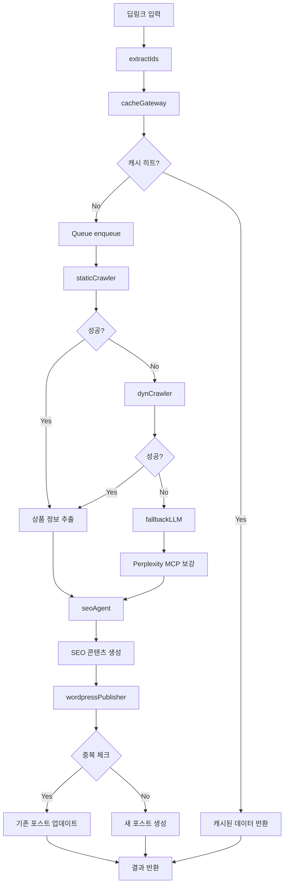

# LangGraph 기반 자동화 시스템 플로우

## 전체 플로우 다이어그램



## 메모리 전략

### 1. RedisSaver (Scrape Graph용)
- **용도**: 크롤링 실패 시 복구를 위한 장기 스냅샷
- **저장 위치**: Redis
- **TTL**: 24시간
- **저장 시점**: 각 노드 실행 후
- **복구 방식**: 실패 노드부터 재시작

```typescript
// RedisSaver 설정
const scrapeGraph = createClient<LangGraphState>({
  checkpointer: new RedisSaver({
    url: process.env.REDIS_URL!,
    ttl: 86400,
    prefix: 'langgraph:scrape:'
  })
});
```

### 2. MemorySaver (SEO Agent용)
- **용도**: 대화 히스토리 요약 관리
- **저장 위치**: 메모리 (RAM)
- **TTL**: 세션 종료 시까지
- **저장 시점**: 메시지가 N개 넘어갈 때
- **관리 방식**: 최근 3개 + 요약만 유지

```typescript
// MemorySaver 설정
const seoAgentGraph = createClient<SEOState>({
  checkpointer: new MemorySaver({
    maxMessages: 10,
    summaryThreshold: 5
  })
});
```

### 3. Cross-thread KV (WordPress Publisher용)
- **용도**: 중복 게시 방지
- **저장 위치**: Redis KV Store
- **키**: `wordpress:post:{productId}`
- **값**: `{postId, postUrl, status, timestamp}`
- **TTL**: 30일

```typescript
// Cross-thread KV 사용
const existingPost = await redis.get(`wordpress:post:${productId}`);
if (existingPost) {
  // PUT/patch로 업데이트
} else {
  // POST로 새 게시
}
```

## 노드별 상세 설명

### 1. extractIds 노드
- **입력**: URL 배열 또는 키워드
- **처리**: 정규식으로 productId 추출
- **출력**: productId 배열
- **체크포인트**: 필요 없음 (빠른 처리)

### 2. cacheGateway 노드
- **입력**: productId 배열
- **처리**: Redis 캐시 검사
- **출력**: 캐시 히트/미스 결과
- **체크포인트**: 필요 없음 (빠른 처리)

### 3. staticCrawler 노드
- **입력**: 상품 URL
- **처리**: HTTP 요청 + HTML 파싱
- **출력**: 상품 정보 구조화
- **체크포인트**: RedisSaver (실패 시 재시도)

### 4. dynCrawler 노드
- **입력**: 상품 URL
- **처리**: Playwright 브라우저 크롤링
- **출력**: 상품 정보 구조화
- **체크포인트**: RedisSaver (실패 시 재시도)

### 5. fallbackLLM 노드
- **입력**: 상품 URL + 사용 가능한 정보
- **처리**: Perplexity MCP 툴 호출
- **출력**: 보강된 상품 정보
- **체크포인트**: RedisSaver (실패 시 재시도)

### 6. seoAgent 노드
- **입력**: 보강된 상품 정보
- **처리**: ReAct 패턴으로 SEO 콘텐츠 생성
- **출력**: SEO 최적화된 블로그 글
- **체크포인트**: MemorySaver (대화 히스토리 요약)

### 7. wordpressPublisher 노드
- **입력**: SEO 콘텐츠
- **처리**: WordPress REST API 호출
- **출력**: 게시된 포스트 정보
- **체크포인트**: Cross-thread KV (중복 방지)

## 오류 처리 전략

### 1. 재시도 로직
```typescript
const retryConfig = {
  maxRetries: 3,
  backoffMs: 1000,
  jitter: true
};
```

### 2. 폴백 노드
- staticCrawler 실패 → dynCrawler
- dynCrawler 실패 → fallbackLLM
- fallbackLLM 실패 → 최종 실패

### 3. 타임아웃 처리
- 노드별 타임아웃: 30초
- 전체 그래프 타임아웃: 5분

## 성능 최적화

### 1. 캐시 전략
- Redis 캐시 히트 시 크롤링 노드 스킵
- 캐시 TTL: 24시간

### 2. 병렬 처리
- 독립적인 productId는 병렬 처리
- 노드 내부에서도 병렬 처리 가능

### 3. 리소스 관리
- 브라우저 인스턴스 풀링
- API 요청 제한 관리
- 메모리 사용량 모니터링 